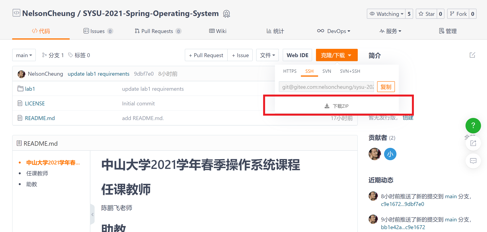

# 中山大学2021学年春季操作系统课程
<center>
    任课老师：陈鹏飞
<br>    
    助教：陈泓仰、谢文欣、傅禹泽、张钧宇
</center>

# 目录说明

+ `labX`是第`X`次实验的指导材料、代码和PPT的文件夹。
+ `labX/README.md`是第`X`次实验的指导、要求和提交时间的文档。
+ `docs`是参考资料的文件夹。
+ `本科生实验报告模板.docx`是报告的模板。

# 实验内容的获取

## 方法一

每次点击`下载ZIP`将整个项目下载下来。



## 方法二

> 在此之前，同学们需要**安装并配置**git，详情参考廖雪峰的git教程[https://www.liaoxuefeng.com/wiki/896043488029600]

由于方法一每次都会重复下载历史的文件，非常麻烦，方法二则提供了git的使用方法。如果还未在本地建立git连接，则需要新建一个文件夹，例如`oslab`。然后在`oslab`下初始化git

```shell
git init
```

创建了git仓库后，我们建立远程仓库连接。

```shell
git remote add gitee git@gitee.com:nelsoncheung/sysu-2021-spring-operating-system.git
```

此后，当远程仓库更新时，我们就从远程仓库中拉取最新的内容。

```shell
git pull gitee main
```

**注意，我们的项目默认发布在`main`分支上，不是`master`分支。**

# 其他资料

清华大学的rCore项目使用的是rust+arm的开发模式。同时，rCore也给出了相应的指导材料[https://github.com/rcore-os/rCore-Tutorial]。rCore分为十章，包含了操作系统实验的全部内容，分别是独立可执行程序、最小化内核、中断、内存管理、内存虚拟化、内核线程、线程调度、进程、文件系统、同步互斥。

另外一个相关的操作系统教程[https://github.com/rust-embedded/rust-raspberrypi-OS-tutorials]是基于raspberry 3/4和rust来做的。

Cambridge使用的是raspberry+assembly开发的模式[https://www.cl.cam.ac.uk/projects/raspberrypi/tutorials/os/index.html]，且raspberry是Cambridge开发的。因此，在Cambridge的教程中，其从汇编和硬件编程的角度来给出操作系统的实验方案。并且，Cambridge还给出了图形化界面的编程细节，而其他教材并未提及相关内容。但是，Cambridge的教材中并未覆盖操作系统的重要概念，如线程和进程，并且教材通篇使用arm汇编实现。

Standford CS107e[http://cs107e.github.io/]使用的是raspberry+assembly+C的开发模式，其不仅涉及底层的编程细节如arm汇编和硬件交互等，还使用C实现了操作系统的重要概念，包括Larson Scanner, Clock, Formatting lib, backtrace, malloc, io, graphics lib, interrupt, system monitor。但是，cs107e并未实现进程、线程和文件系统等。而且cs107e和其他使用raspberry来作为实验环境的实验一样，过于强调真实硬件的使用，即在物理环境的raspberry pi上跑程序。

有一个使用x86+rust的实现方案[https://os.phil-opp.com/]，实际上这个是方案是rCore的主要参考资料之一，基本上和rCore相一致，并详细指出了使用rust开发操作系统过程中需要调整的地方，如`#![no_std]`，同时给出调整的原因。

另外一些相关工作并未直接给出操作系统的实现指导，但确是实现操作系统不可或缺的知识，如下所示。

+ Arm program user guide，这是arm公司给出的arm编程的指导；
+ Bare-metal C programming on ARM[https://github.com/umanovskis/baremetal-arm]基于开发板vexpress-a9(arm公司设计的开发板)给出如何使用C对特定的arm处理器(Cortex A series)和特定的硬件编程(GPIO等)；
+ Bare Metal Programming on Raspberry Pi 3[https://github.com/bztsrc/raspi3-tutorial]用rust给出了raspberry硬件编程的指导。
+ ARM assembler in Raspberry Pi[https://thinkingeek.com/arm-assembler-raspberry-pi/]和Raspberry-Pi Bare Metal Tutorial[https://github.com/BrianSidebotham/arm-tutorial-rpi/]给出的均是raspberry的硬件编程指导，前者关注于arm汇编，后者关注于C。
+ The Embedded rust book[https://rust-embedded.github.io/book/intro/index.html]是rust的官方指导，其给出了使用rust来做嵌入式开发的指导。
+ 《嵌入式linux开发》等书籍无外乎从嵌入式linux来给出嵌入式linux的架构设计、arm汇编和特定的开发板开发教程和linux源码分析，可作为操作系统顶层设计的指导材料。