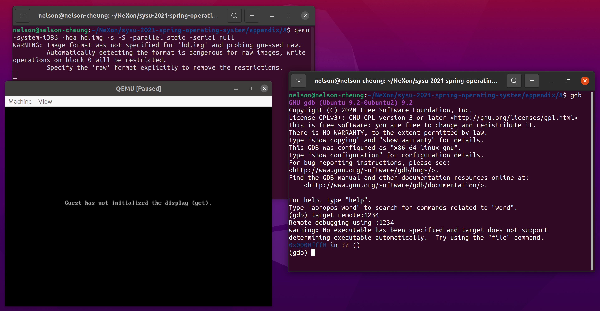
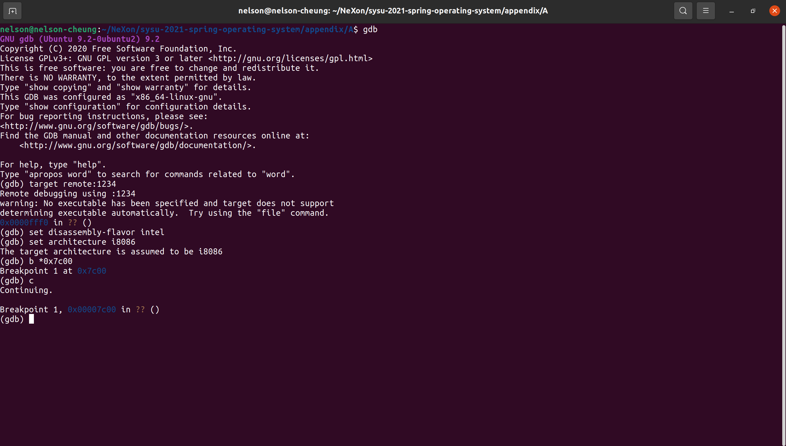

# gdb+qemu的debug方法

虽然网上关于gdb的教程非常多，但大多数教程都是介绍如何使用gdb来调试一个运行在特定的操作系统上的程序，关于如何使用gdb来调试操作系统开发的代码则是凤毛麟角。例如，关于如何对C语言的代码进行单步跟踪提的很多，但关于对汇编的代码进行单步跟踪提的很少。因此，在本章中，我们将会通过3个简单的例子来学习如何使用gdb和qemu来调试我们的操作系统代码。

# 基本调试思路

使用gdb和qemu调试操作系统的基本流程如下。

1. **qemu启动**。我们先在一个Terminal下启动qemu，注意，qemu运行的参数需要加上`-s -S`参数，且在gdb启动之前不能关闭qemu。
2. **gdb启动**。在另一个Terminal下启动gdb并连接上第1步启动的qemu。
3. **设置断点**。gdb运行到我们设置的断点处会暂停，我们一般会在我们感兴趣的代码地址处设置断点，断点一般是我们认为bug出现的地方。
4. **运行至断点处**。使用命令跳过其他我们不感兴趣的代码，使代码一直执行到我们设置的断点处暂停。
5. **查看寄存器或特定地址的值**。我们可以在gdb暂停的地方查看寄存器或特定地址的值，并根据输出来判断前面执行的代码是否出现bug。
6. **单步调试跟踪**。gdb在断点处暂停后，我们可以一条一条语句地执行来跟踪程序的运行逻辑，gdb每执行条语句就会暂停。
7. **重复3、4、5、6一直到bug解决**。这个过程可能需要反复执行，但不一定是按照$\{3, 4, 5, 6\}$的顺序，可以是$\{3, 4, 6, 5, 6, 6, 6, 5, 3, 4, 5\}$。

# 常用的gdb调试指令

| gdb指令                      | 含义                                                         | 实例                                                         |
| ---------------------------- | ------------------------------------------------------------ | ------------------------------------------------------------ |
| break *adress或b *address    | 在地址adress处设置断点。                                     | break *0x7c00<br>b *0x7c00                                   |
| break symbol或b symbol       | 在符号symbol处设置断点，例如symbol一般是函数名。             | break setup\_kernel<br>b setup\_kernel                       |
| x/FMT address                | address是内存地址，FMT格式是重复的单元个数+格式+大小。<br/>重复的单元个数是一个数字，表示我们希望查看多少个单元。正数表示从address向后查看。负数表示从address向前查看。<br/>格式是一个字符，可以是o(octal), x(hex), d(decimal), u(unsigned decimal), t(binary), f(float), a(address), i(instruction), c(char), s(string)。<br/>大小是一个字符，可以是b(byte, 1 byte), h(halfword, 2 byte), w(word, 4 byte), g(giant, 8 bytes)。 | x/5xw 0x8032(显示从0x8032开始的5个字，以16进制显示)<br/>x/10i 0x7c00(显示从0x7c00开始的10条汇编指令)<br/>x/10i \$pc(显示当前指令后面的10条汇编指令，包括当前指令)<br/>x/12xw \$esp(显示栈中的12个字，以16进制显示) |
| continue或c                  | 继续执行正在调试的程序到断点处暂停。                         |                                                              |
| step或s                      | 执行一条C语句，如果遇到函数调用语句，则会进入函数体中。      |                                                              |
| next或n                      | 执行一条C语句，函数调用语句不会进入函数体，把函数当成一条语句执行。 |                                                              |
| stepi或si                    | 执行一条汇编语句，如果遇到函数调用语句，则会进入函数体中。   |                                                              |
| nexti或ni                    | 执行一条汇编语句，函数调用语句不会进入函数体，把函数当成一条语句执行。 |                                                              |
| info registers               | 查看所有寄存器的值                                           |                                                              |
| layout layout\_name          | layout\_name包含src，asm，split，regs。<br/>src显示源代码窗口和命令窗口，asm显示汇编代码窗口和命令窗口，split显示源代码窗口、汇编代码窗口和命令窗口，regs显示寄存器窗口。 | layout split                                                 |
| focus layout\_window         | 转换当前窗口到layout窗口，layout\_window包含src，asm，regs，cmd。任何时刻gdb的当前窗口只有一个，并且使用方向键的效果只会在当前窗口处显示。<bt/> | focus cmd                                                    |
| file symbol\_file            | 加载符号表，为gdb提供debug信息。                             | file ../build/kernel.o                                       |
| set disassembly-flavor intel | 设置汇编代码格式为intel风格                                  |                                                              |
| set architecture name        | 设置指令对应的CPU架构，name包含i8086(16位)，i386(32位)       | set architecture i386                                        |

# 16位汇编代码

> 我们以lab2的example 1来介绍16位汇编代码的debug思路。

我们首先启动qemu。

```shell
qemu-system-i386 -hda hd.img -s -S -parallel stdio -serial null
```

在另外一个终端下启动gdb。

```
gdb
```

在gdb下连接qemu。

```shell
target remote:1234
```

得到如下结果，可以看到程序暂停在0xFFF0处。



>  注意，如下命令均在gdb下执行。

我们首先开始设置汇编代码风格为intel风格。

```
set disassembly-flavor intel
```

由于lab2的example 1运行在16位的实模式下，我们设置代码对应CPU的CPU架构为`i8086`。

```
set architecture i8086
```

设置断点在MBR的第一条指令的地址处`0x7C00`。

```
b *0x7c00
```

输入c运行至断点`0x7C00`处。

```
c
```

此时，gdb暂停在了`0x7C00`处。



我们反汇编查看自当前指令(`0x7C00`)后开始的20条指令。

```
x/20i $pc
```

输出结果如下。


虽然上面的数字是以32位显示的，但我们主要关注16位即可。我们在运行至断点后，总是会关心断点后的若干条语句是什么。如果每次都需要输入`x/10i`来反汇编查看指令则略显麻烦。此时，我们可以开启gdb的反汇编窗口，在反汇编窗口下会自动显示当前指令和其后的若干条指令。

```
layout asm
```


接着，我们在输出`Hello World`的起始语句处设置断点。

```
b *0x7c18
```

运行至断点。

```
c
```

结果如下。


我们单步执行5条汇编指令。注意，由于这里没有函数调用语句，所以使用`si`和`ni`都是相同的结果。

```
ni
```

结果如下，可以看到qemu输出了`Hello`。


我们查看`0xB8000`开始的5个单元，每个单元是16字节。

```
x/5xh 0xb8000
```


结果和qemu的输出吻合。

至此，我们已经学习完gdb+qemu的debug流程。

# 32位汇编代码


# C/C++代码

# 配合Makefile使用