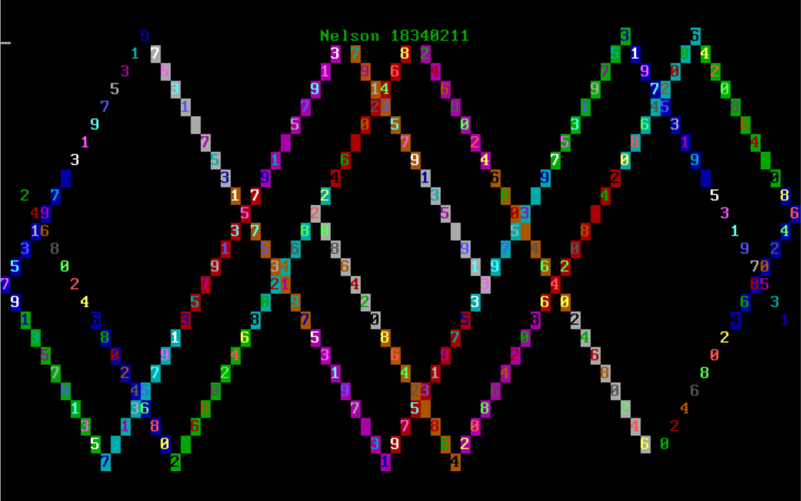

# 实验要求

## assignment 1 MBR

> 注意，assignment 1的寄存器请使用16位的寄存器。

### 1.1

复现example 1。说说你是怎么做的，并将结果截图。

### 1.2

请修改example 1的代码，使得MBR被加载到0x7C00后在$(12,12)$处开始输出你的学号。注意，你的学号显示的前景色和背景色必须和教程中不同。说说你是怎么做的，并将结果截图。

## assignment 2 实模式中断

### 2.1

请修改1.2的代码，使用实模式下的中断来输出你的学号，可以参考[https://blog.csdn.net/lindorx/article/details/83957903]。说说你是怎么做的，并将结果截图。

### 2.2

请探索实模式下的光标中断，利用中断实现光标的位置获取和光标的移动，可以参考[https://blog.csdn.net/lindorx/article/details/83957903]。说说你是怎么做的，并将结果截图。

### 2.3

在2.1和2.2的知识的基础上，探索实模式的键盘中断，利用键盘中断实现键盘输入并回显，可以参考[https://blog.csdn.net/deniece1/article/details/103447413]。关于键盘扫描码，可以参考[http://blog.sina.com.cn/s/blog_1511e79950102x2b0.html]。说说你是怎么做的，并将结果截图。

## assignment 3 汇编

> + assignment 3的寄存器请使用32位的寄存器。
> + 你需要实现的代码文件在`student.asm`中。
> + 编写好之后使用命令`make run`即可测试，不需要放到mbr中使用qemu启动。
> + `a1`、`if_flag`、`my_random`等都是预先定义好的变量和函数，直接使用即可。
> + 你可以修改`test.cpp`中的`student_setting`中的语句来得到你想要的`a1,a2`。
> + 最后附上`make run`的截图，并说说你是怎么做的。

### 3.1 分支逻辑的实现

请将下列伪代码转换成汇编代码，并放置在标号`your_if`之后。

```
if a1 < 12 then
	if_flag = a1 * 2 + 1
else if a1 < 24 then
	if_flag = (24 - a1) * a1
else
	if_flag = a1 << 4
end
```

### 3.2 循环逻辑的实现

请将下列伪代码转换成汇编代码，并放置在标号`your_while`之后。

```
while a2 >= 12 then
	call my_random        // my_random将产生一个随机数放到eax中返回
	while_flag[a2 - 12] = eax
	--a2
end
```

### 3.3 函数的实现

请编写函数`your_function`并调用之，函数的内容是遍历字符数组`string`。

```
your_function:
	for i = 0; string[i] != '\0'; ++i then
		popad
		push string[i] to stack
		call print_a_char
		pop stack
		popad
	end
	return
end
```

## assignment 4

字符弹射程序。请编写一个字符弹射程序，其从点$(2,0)$处开始向右下角45度开始射出，遇到边界反弹，反弹后按45度角射出，方向视反弹位置而定。同时，你可以加入一些其他效果，如变色，双向射出等。注意，你的程序应该不超过510字节，否则无法放入MBR中被加载执行。静态示例效果如下，动态效果见视频。

