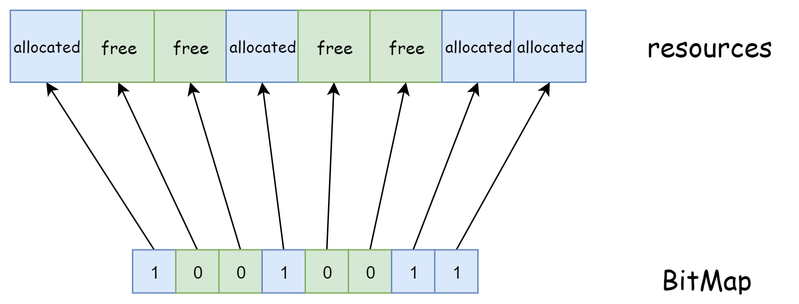

# 内存管理

# TODO

+ stdlib.h 代码注释, bitmap.h注释修改
+ bitmap解释不清楚
+ 引入bitmap的原因

# 参考资料

+ [获取内存容量](https://zhuanlan.zhihu.com/p/35776128)
+ 《操作系统真象还原》

# 实验概述

# 实验要求

# 内存的探查

在进行内存管理之前，我们的首要任务是获取操作系统可管理的内存的容量。在实模式下，我们可以通过`15h`中断来获取机器的内存大小。资料“获取内存容量”中介绍了3种获取机器内存的方法，我们这里选取了功能号为`0xe801`的`15h`中断来获取内存。

此方法相较于另外两种方法较为简单，调用这个功能只需要在ax寄存器中存入功能号0xe801即可，无需其他的输入数据。但是，此方法最大只能获取到4GB的内存空间。中断返回结果是内存的大小，保存在寄存器中。返回的内存大小是分为两部分的，ax寄存器中存放的是低于15MB的内存大小，单位是1KB，bx寄存器中存放的是16MB\~4GB的内存大小，单位是64KB。因此，内存总容量为
$$
内存总容量=(\text{ax}\cdot 1024+\text{bx}\cdot64\cdot1024)\ \text{bytes}
$$
在bootloader中，我们实现了从实模式跳转到了保护模式，而实模式中断在保护模式下无法使用。因此，我们无法在保护模式下使用`15h`中断来获取内存大小。同时，内存管理的代码又需要运行保护模式下，在不知道内存大小的情况下我们也无法实现内存管理。这就产生了矛盾。矛盾的解决方法也非常简单，我们首先在实模式下调用中断获取内存大小，然后将内存大小写入一个固定的地址，最后在保护模式下建立内存管理时，从这个固定的地址中读出内存大小即可。下面我们来实现我们的想法。

我们首先修改`src/boot/mbr.asm`的代码。在跳转到bootloader前，我们调用中断获取内存的大小，然后将存储中断返回结果的ax和bx寄存器的内容写入地址0x7c00。

```assembly
...

load_bootloader: 
    push ax
    push bx
    call asm_read_hard_disk  ; 读取硬盘
    add sp, 4
    inc ax
    add bx, 512
    loop load_bootloader

    ; 获取内存大小
    mov ax, 0xe801
    int 15h
    mov [0x7c00], ax
    mov [0x7c00+2], bx

    jmp 0x0000:0x7e00        ; 跳转到bootloader
    
...
```

接着，我们在`first_thread`中读取内存大小。

```assembly
...

void first_thread(void *arg)
{
	...
	
    uint32 memory = *((uint32 *)MEMORY_SIZE_ADDRESS);
    // ax寄存器保存的内容
    uint32 low = memory & 0xffff;
    // bx寄存器保存的内容
    uint32 high = (memory >> 16) & 0xffff;
    memory = low * 1024 + high * 64 * 1024;
    printf("total memory: %d bytes (%d MB)\n", memory, memory / 1024 / 1024);

    asm_halt();
}

...
```

其中，`MEMORY_SIZE_ADDRESS`定义在`include/os_constant.h`下。

```c++
#define MEMORY_SIZE_ADDRESS 0x7c00
```

第7行，我们从0x7c00处读入了获取中断的结果。

第8-11行，根据写入时的顺序，`memory`的低16位是ax保存的内容，高16位是bx保存的内容。

第12行，根据上面提到的内存容量的计算公式，我们可以得到内存的容量。

上面的代码运行结果如下。


从结果中可以看到，我们可管理的内存大小是126MB。

得到了内存的大小后，我们来学习如何实现简单的内存管理。

# 位图

## 概念

位图，BitMap，是用于资源管理的一种数据结构。BitMap使用一位来和一个资源单元建立映射关系，例如使用1表示资源单元已经被分配，使用0表示资源单元空闲，如下所示。



使用BitMap可以以较小的代价实现对资源的管理。对于4GB的内存，在分页机制下，我们将资源单元定为一个物理页，大小为4KB。因此，使用BitMap来对该内存进行管理时，BitMap的大小为
$$
\frac{4GB}{8*4KB}=128KB.
$$
其内存占比为
$$
\frac{128KB}{4GB}*100\%=0.00305\%.
$$
可见使用BitMap来对资源管理时，其空间效率较高。下面我们来实现BitMap。

## BitMap的实现

从代码层面上去考察BitMap时，BitMap的成员包括

+ 一块存放BitMap的内存区域。
+ BitMap管理的资源单元数量。
+ 单独存取位和批处理存取位的方法。

如下所示，BitMap的定义放置在`include/bitmap.h`中。

```c++
class BitMap
{
public:
    // 被管理的资源个数，bitmap的总位数
    int length;
    // bitmap的起始地char址
    char *bitmap;
public:
    // 初始化
    BitMap();
    // 设置BitMap，bitmap=起始地址，length=总位数(被管理的资源个数)
    void initialize(char *bitmap, const int length);
    // 获取第index个资源的状态，true=allocated，false=free
    bool get(const int index) const;
    // 设置第index个资源的状态，true=allocated，false=free
    void set(const int index, const bool status);
    // 分配count个连续的资源，若没有则返回-1，否则返回分配的第1个资源单元序号
    int allocate(const int count);
    // 释放第index个资源开始的count个资源
    void release(const int index, const int count);
    // 返回Bitmap存储区域
    char *getBitmap();
    // 返回Bitmap的大小
    int size() const;
private:
    // 禁止Bitmap之间的赋值
    BitMap(const BitMap &) {}
    void operator=(const BitMap&) {}
};
```

为什么我们需要从外界向BitMap提供存储区域呢？这是因为我们使用BitMap来实现内存管理，所以我们无法使用动态内存分配来在BitMap的初始化函数中分配一个存储区域。在后面的实现中可以看到，我们会在内存中手动划分出一块区域来存储BitMap用来标识资源分配情况的位。

注意，BitMap的成员是有指针的。一般情况下，成员涉及指针的对象的赋值都需要使用动态内存分配获得一个新的指针，但我们还没有实现动态内存分配。所以，我们将`copy constructor`和`operator=`定义为private来禁止BitMap之间的直接赋值。这也是为什么我们在BitMap的初始化函数`initialize`中需要提供bitmap的存储区域。

根据BitMap的描述，我们不难实现BitMap的成员函数，如下所示，代码放置在`src/utils/bitmap.cpp`中。

```cpp
BitMap::BitMap()
{
    initialize(nullptr, 0);
}

void BitMap::initialize(char *bitmap, const int length)
{
    this->bitmap = bitmap;
    this->length = length;

    int bytes = ceil(length, 8);
    memset(bitmap, 0, bytes);

}

bool BitMap::get(const int index) const
{
    int pos = index / 8;
    int offset = index % 8;

    return (bitmap[pos] & (1 << offset));
}

void BitMap::set(const int index, const bool status)
{
    int pos = index / 8;
    int offset = index % 8;

    // 清0
    bitmap[pos] = bitmap[pos] & (~(1 << offset));

    // 置1
    if (status)
    {
        bitmap[pos] = bitmap[pos] | (1 << offset);
    }
}

int BitMap::allocate(const int count)
{
    if (count == 0)
        return -1;

    int index, empty, start;

    index = 0;
    while (index < length)
    {
        // 越过已经分配的资源
        while (index < length && get(index))
            ++index;

        // 不存在连续的count个资源
        if (index == length)
            return -1;

        // 找到1个未分配的资源
        // 检查是否存在从index开始的连续count个资源
        empty = 0;
        start = index;
        while ((index < length) && (!get(index)) && (empty < count))
        {
            ++empty;
            ++index;
        }

        // 存在连续的count个资源
        if (empty == count)
        {
            for (int i = 0; i < count; ++i)
            {
                set(start + i, true);
            }

            return start;
        }
    }

    return -1;
}

void BitMap::release(const int index, const int count)
{
    for (int i = 0; i < count; ++i)
    {
        set(index + i, false);
    }
}

char *BitMap::getBitmap()
{
    return (char *)bitmap;
}

int BitMap::size() const
{
    return length;
}
```

上面的代码逻辑比较清晰，因此这里只说明BitMap如何找到资源单元对应的状态位。

当我们我们使用指针来访问BitMap的存储区域时，最小的访问单元是字节，而资源单元的状态是使用一个位来表示的。因此，给定一个资源单元的序号$i$，我们无法通过`bitmap[i]`的方式来直接修改资源单元的状态。我们的做法是先定位到存储第$i$个资源单元的字节序号$pos$，然后再确定第$i$个资源单元的状态位在第$pos$字节中的偏移位置$offset$，最后使用位运算来修改该位即可，如下所示。
$$
i=8\cdot pos+offset,\ 0 \le offset<8
$$
注意，$offset$是从最低位开始算起的。

# 地址池

在开启分页机制之后，我们的内存就会被划分为一个个的固定长度的块，这个块被称为页。在保护模式下，一个页的大小是4KB。在程序设计的过程中，我们常常需要进行动态内存分配。我们会使用malloc来分配任意字节大小的内存，使用free来释放任意字节大小的内存。从我们目前的进度来看，实现以字节为粒度的内存管理方法并不怎么现实。但是，假如我们强制要求每次分配的内存大小只能是一个页，每次释放的内存大小也是一个页。这样的内存管理实现起来是简单的，因为我们只需要记录下内存中哪些页是已经被分配的，哪些页是空闲的就可以了。这种内存管理方法被称为页内存管理。在后面的章节中，我们将会学习如何使用页内存管理来实现以字节为粒度的内存管理，从而实现我们的malloc和free。这里，我们只需要实现页内存管理即可。

为了实现页内存分配，我们需要使用一种结构来标识地址空间中的哪些页是已经被分配的，哪些是未被分配的。这种结构被称为地址池。当需要页内存分配时，我们可以从地址池中取出一个空闲页。然后地址池便会标识该空闲页已被分配，最后计算并返回该空闲页对应的地址。空闲页只要没有被释放，就不会被再次分配。

注意到BitMap可用于资源的管理，地址池实际上使用了BitMap来对其地址空间进行管理。

从代码层面上来看，地址池的定义如下所示，代码放置在`include/address_pool.h`中。

```cpp
class AddressPool
{
public:
    BitMap resources;
    int startAddress;
public:
    AddressPool();
    // 初始化地址池
    void initialize(char *bitmap, const int length,const int startAddress);
    // 从地址池中分配count个连续页，成功则返回第一个页的地址，失败则返回-1
    int allocate(const int count);
    // 释放若干页的空间
    void release(const int address, const int amount);
};
```

第4-5行，地址池是对连续的若干个页进行管理的数据结构。所以我们会使用`resources`来标识地址池中哪些页是空闲的，哪些页是被分配的。我们使用`startAddress`来记录地址池管理的页的共同起始地址。假设每一页的大小为$PAGE\_SIZE$，那么地址池中的第$i$页的起始地址$address$为
$$
address=startAddress+i\times PAGE\_SIZE
$$
`AddressPool`的实现放在`src/utils/address_pool.cpp`中，如下所示。

```cpp
AddressPool::AddressPool()
{
}

// 设置地址池BitMap
void AddressPool::initialize(char *bitmap, const int length, const int startAddress)
{
    resources.initialize(bitmap, length);
    this->startAddress = startAddress;
}

// 从地址池中分配count个连续页
int AddressPool::allocate(const int count)
{
    uint32 start = resources.allocate(count);
    return (start == -1) ? -1 : (start * PAGE_SIZE + startAddress);
}

// 释放若干页的空间
void AddressPool::release(const int address, const int amount)
{
    resources.release((address - startAddress) / PAGE_SIZE, amount);
}
```

代码逻辑较为简单，这里便不再赘述。

# 物理内存管理

> 代码放置在`src/3`下。

对于我们的物理内存，我们将其划分为两部分。第一部分是内核空间，第二部分是用户空间。实际上，我们现在编写的所有代码都是运行在内核空间下的。用户空间的概念需要等到我们实现了进程后才会理解。为了便于我们理解这样划分的目的，我们简单地梳理一下二者的区别。

到目前为止，我们在`0x7c00`处放入了MBR，在MBR之后放入了bootloader。在bootloader之后放入了我们的操作系统的代码。现在我们看到的内存安排和存放的内容实际上都是属于内核空间。从另外一个角度来看，现在我们编写的代码的作用包括进程管理、IO管理、中断管理等。显然，这部分代码属于特权代码，只能运行在内核空间下。

对于我们在操作系统上执行的程序，例如hello.cpp

```cpp
#include <stdio.h>

int main() {
    printf("Hello World\n");
}
```

我们首先会编译这段代码

```shell
g++ hello.cpp -o hello.out
```

然后执行

```shell
./hello.out
```

此时，我们的操作系统会为可执行文件`hello.out`创建一个进程，这个进程会执行`hello.out`的代码，`hello.out`的数据存放在操作系统为进程分配的空间中，`hello.out`的代码、数据和栈等存放的空间就是用户空间。

每一个程序都有一个独立的用户空间，例如`hello.out`，并且用户空间都是从0开始的。所以，每一时刻，我们操作系统中会存在一个内核空间和若干个用户空间。这些空间为什么不会造成冲突呢？这得益于分页机制。事实上，开启了分页机制后，我们在代码中使用的地址就不再是实际的物理地址，而是线性地址（又称虚拟地址）。CPU会根据线性地址和MMU（Memory Manage Unit）来自动地将线性地址转换为物理地址，然后访问这个物理地址。通过分页机制，我们可以将同一个线性地址映射到不同的物理地址中。而进程和内核都有自己的页目录表和页表，所以我们就可以通过分页机制来保证这些空间不会产生冲突。

为了有效隔离内核和用户程序。我们将整个物理地址空间划分为两部分，内核空间和用户空间。

在我们的操作系统实现当中，我们会使用两个地址池来对这两部分物理地址进行管理。代码放置在`include/memory.h`下，我们使用类`MemoryManager`来执行内存管理。

```cpp
enum AddressPoolType
{
    USER,
    KERNEL
};

class MemoryManager
{
public:
    // 可管理的内存容量
    int totalMemory;
    // 内核物理地址池
    AddressPool kernelPhysical;
    // 用户物理地址池
    AddressPool userPhysical;

};
```

接着，我们向`MemoryManager`中加入初始化和分配释放物理内存的函数。

```cpp
class MemoryManager
{
public:
    // 可管理的内存容量
    int totalMemory;
    // 内核物理地址池
    AddressPool kernelPhysical;
    // 用户物理地址池
    AddressPool userPhysical;

public:
    MemoryManager();

    // 初始化地址池
    void initialize();

    // 从type类型的物理地址池中分配count个连续的页
    // 成功，返回起始地址；失败，返回0
    int allocatePhysicalPages(enum AddressPoolType type, const int count);

    // 释放从paddr开始的count个物理页
    void releasePhysicalPages(enum AddressPoolType type, const int startAddress, const int count);

    // 获取内存总容量
    int getTotalMemory();

};
```

我们接下来看物理内存管理是如何实现的。

首先，在进行物理内存管理之前，我们需要进行初始化。

```cpp
MemoryManager::MemoryManager() {
    initialize();
}

void MemoryManager::initialize()
{
    this->totalMemory = 0;
    this->totalMemory = getTotalMemory();

    // 预留的内存
    int usedMemory = 256 * PAGE_SIZE + 0x100000;
    if(this->totalMemory < usedMemory) {
        printf("memory is too small, halt.\n");
        asm_halt();
    }
    // 剩余的空闲的内存
    int freeMemory = this->totalMemory - usedMemory;

    int freePages = freeMemory / PAGE_SIZE;
    int kernelPages = freePages / 2;
    int userPages = freePages - kernelPages;

    int kernelPhysicalStartAddress = usedMemory;
    int userPhysicalStartAddress = usedMemory + kernelPages * PAGE_SIZE;

    int kernelPhysicalBitMapStart = BITMAP_START_ADDRESS;
    int userPhysicalBitMapStart = kernelPhysicalBitMapStart + ceil(kernelPages, 8);

    kernelPhysical.initialize((char *)kernelPhysicalBitMapStart, kernelPages, kernelPhysicalStartAddress);
    userPhysical.initialize((char *)userPhysicalBitMapStart, userPages, userPhysicalStartAddress);

    printf("total memory: %d bytes ( %d MB )\n", 
            this->totalMemory, 
            this->totalMemory / 1024 / 1024);

    printf("kernel pool\n"
           "    start address: 0x%x\n"
           "    total pages: %d ( %d MB )\n"
           "    bitmap start address: 0x%x\n",
           kernelPhysicalStartAddress, 
           kernelPages, kernelPages * PAGE_SIZE / 1024 / 1024,
           kernelPhysicalBitMapStart);

    printf("user pool\n"
           "    start address: 0x%x\n"
           "    total pages: %d ( %d MB )\n"
           "    bit map start address: 0x%x\n",
           userPhysicalStartAddress, 
           userPages, userPages * PAGE_SIZE / 1024 / 1024,
           userPhysicalBitMapStart);
}
```

第7-8行，我们读取之前在实模式下使用中断获取的内存大小，读入内存大小的函数如下。

```cpp
int MemoryManager::getTotalMemory()
{

    if(!this->totalMemory)
    {
        int memory = *((int *)MEMORY_SIZE_ADDRESS);
        // ax寄存器保存的内容
        int low = memory & 0xffff;
        // bx寄存器保存的内容
        int high = (memory >> 16) & 0xffff;

        this->totalMemory = low * 1024 + high * 64 * 1024;
        
    }

    return this->totalMemory;
}
```

第11行，我们在内存中预留了部分内存。0x00000000\~0x00100000存放的是我们的内核，1MB以上的剩余部分存放内核页表。

第19-21行，前面我们已经提到，为了简便起见，我们实现的内存管理是页内存管理。并且我们将物理内存空间划分为两部分，内核物理地址空间和用户物理地址空间。这里，我们的划分方式是等分，即两个物理地址空间的大小相同。

第23-24行，我们计算两个物理地址空间的起始地址，用户物理地址空间紧跟在内核物理地址空间后面。

第26-27行，我们在1MB以下的空间处人为划分了两部分区域，用来存放内核空间和用户空间的位图（BitMap）。

第29-30行，我们对两部分空间的地址池进行初始化。

第32-50行，我们将内存管理的基本信息打印出来。

初始化了`MemoryManager`后，我们便可以实现物理内存管理，如下所示。

```cpp
int MemoryManager::allocatePhysicalPages(enum AddressPoolType type, const int count)
{
    int start = -1;

    if (type == AddressPoolType::KERNEL)
    {
        start = kernelPhysical.allocate(count);
    }
    else if (type == AddressPoolType::USER)
    {
        start = userPhysical.allocate(count);
    }

    return (start == -1) ? 0 : start;
}

void MemoryManager::releasePhysicalPages(enum AddressPoolType type, const int paddr, const int count)
{
    if (type == AddressPoolType::KERNEL)
    {
        kernelPhysical.release(paddr, count);
    }
    else if (type == AddressPoolType::USER)
    {

        userPhysical.release(paddr, count);
    }
}
```

代码比较简单，这里便不再赘述。

接下来，我们开始实现操作系统中最精彩的部分——开启分页机制。

# 二级分页机制

## 缘由

虽然计算机的内存容量在不断增大，容量也从原先的B级发展为今天的GB级，但是，我们依然无法将所有的程序放入内存中执行。因此，我们要确定哪些程序是可以放入内存的，哪些程序是暂时放在外存。除此之外，当我们实现了多线程和多进程后，我们希望这些线程和进程在运行时互不干扰，即它们无法访问对方的地址空间，从而实现了内存保护。

上面实际上提到了两个问题。

+ 程序是如何装入内存的。
+ 内存的保护是如何实现的。

我们首先来学习程序是如何装入内存的内容。我们在第3章中已经了解到，一份C代码需要经过编译、链接后才能形成可执行程序。但是，这个可执行程序是放在外存中的，也就是磁盘，它需要被加载到内存中才能被执行。程序从外存加载到内存的执行过程被称为程序的装入。

特别注意，程序在被编译后，其起始地址默认是从0开始的。但是，在绝大部份情况下，我们的程序并不是加载到地址为0处运行。例如，我们的bootloader是被加载到`0x7e00`处执行的。如果我们直接将编译后的bootloader加载到`0x7e00`处执行，也就是说，我们没有加上`org`伪指令，或者使用`ld`来指定起始地址。

```asm
; bootloader
org 0x7e00
...
```

此时，对于下面的语句，我们无法正确地跳转到标号`protect_mode_begin`指定的地址后执行。

```asm
; bootloader
...
;以下进入保护模式
jmp dword CODE_SELECTOR:protect_mode_begin  
...
```

因为在我们没有指定代码的起始地址之前，默认的起始地址为0。此时标号`protect_mode_begin`表示的是相对于代码起始位置的偏移地址，假设这个偏移地址是`0x200`。上面这条语句是希望跳转到标号为`protect_mode_begin`的代码处执行。但是，由于程序在编译后的起始地址默认是从0开始的，当我们执行到上面这条语句时，我们实际上会跳转到`0x200`处执行(`CODE_SELECTOR`对应的段描述符的基地址从0开始)，从而发生了错误。

由于bootloader是被加载到`0x7e00`的，我们实际上需要跳转到`0x7e00+0x200`处才是`protect_mode_begin`的代码所在的地方。因此，我们需要加上`org`伪指令，或者使用`ld`来指定起始地址。这样做之后，`protect_mode_begin`的值就变成了`0x7e00+0x200`，符合我们的预期。

对于C语言也是如此，我们的内核是使用C语言写的，C语言的全局变量(如`stdio`，函数名等)的地址也都是偏移地址，而kernel是被加载到`0x20000`处执行的。所以，我们在使用`ld`链接的时候，加上了`-Ttext 0x00020000`参数。此时，`ld`会修改程序中所有的全局变量的地址，为其加上`0x20000`，这就是运行不会出错的原因。

> 对于局部变量，C语言翻译成的汇编代码是使用ebp和esp来访问的，因此不会出错。

我们在编译在kernel后使用ld为其加上了起始地址，然后放入磁盘，最后再加载到约定的起始地址处执行。这个过程被称为程序的绝对装入。实际上，绝对装入只是程序装入内存的3种方式的一种，如下所示。

+ 绝对装入。在链接时，若知道程序将驻留在内存的某个地址，则链接程序将根据实际运行的地址来修改程序的标号的地址，使其和实际运行使用的地址保持一致。例如`ld`中的`-Ttext 0x00020000`，此时直接将程序加载到预先确定的位置便可运行。但是，当加载位置变化后，链接时的地址也要发生变化，否则必定发生错误。
+ 静态重定位。在装入时，我们根据程序被加载位置来修改程序的指令和数据地址。这和绝对装入类似，但还是有区别。对于绝对装入，程序的地址就是实际的使用的地址，而对于静态重定位，程序的地址依旧是从0开始，只有在被加载到内存时才会被修改。
+ 动态重定位。程序被装入内存后依旧是依旧是从0开始。地址的转换被推迟到程序需要寻址时才进行。此时，我们需要MMU(内存管理单元，Memory Management Unit)来完成转换。我们可以改变MMU的内容来实现不同的变换方式，也就是说，即使对于相同的线性地址，在不同的变换方式下，得到的物理地址就会不同，这就是被称为动态重定位的原因。二级分页机制就是典型的动态重定位。

二级分页机制有效地帮助我们来进行程序的动态重定位。

在lab3中，我们接触到了线性地址和物理地址的概念。线性地址是程序使用的地址，物理地址是CPU用来寻址的地址。在开启分页机制之前，二者是相同的。我们在上面的论述中可以看到，我们后面会实现进程，进程是程序运行时的映像。因此，二者使用的地址是相同的地址，即线性地址。进程的线性地址都是从0开始一直到4GB。这些进程不会产生冲突的原因在于每一个进程都会有一个独立的地址空间和页表，通过不同的页表，我们可以将相同的线性地址变换到不同的物理地址，从而解决了冲突。

在实现分页机制之前，我们接下来首先看一下什么是分页机制。

## 一级页表

> 线性地址也会被称作虚拟地址。

在分页机制下，内存被划分为大小相等的内存块，称为页（Page），如下所示。


在现代CPU中，页的大小为4KB。我们知道，CPU最终会使用物理地址来访问程序的代码和数据。在未开启分页机制前，物理地址=段地址+偏移地址。而开启了分页机制后，分段机制依然在发挥作用，只不过段地址+偏移地址不再是实际的物理地址，而是被称为线性地址。线性地址需要经过转换才能变为物理地址，负责这一转换过程的部件称为MMU。MMU集成在CPU中，程序的运行过程虽然给出的是线性地址，但是CPU能够通过页部件将其自动地转换为物理地址。

一级页表先通过线性地址在页表中找到对应的页表项，然后再根据页表项给出的页地址和页内偏移找到实际的物理地址。页的大小是4KB，用低12位来表示（$4K=2^{12}$）。我们知道，保护模式下的地址是4B，32位表示。地址的高20位用来确定页表中的页表项，所以页表中的页表项一共有$2^{20}=1M$项。每一个页表项占4字节，里面保存的是页的物理地址。因此，1M个页表项恰好可以表示$1M*4KB=4GB$的内存，也就是32位的地址空间。

综合上述分析，一级页表的线性地址到物理地址的转换关系如下。

先取线性地址的高20位，高20位的数值表示的是页表项在页表中的序号。而每一个页表项占4字节，所以高20位的数值乘4后才是对应的页表项的地址。从页表项中读出页地址后，由于低20位是页内偏移，使用页地址+低20位即可得出需要访问的物理地址。

我们看下面这个例子。考虑线性地址`0x43e4`。


线性地址到物理地址的变换过程如下所示。

线性地址的高20位是`0x4`，因此我们到页表中去找第`0x4`个页表项，页表项的内容为3，表示线性地址对应的物理页是第3个物理页。线性地址的第12位表示的是页内偏移，因此线性地址`0x43e4`对应的地址是第3个物理页中偏移地址为`0x3e4`的地址。由于一个物理页的大小为4KB，线性地址对应的物理地址是`0x33e4`，实际上就是用物理页号去替换线性地址中的页号。

明白了一级分页机制的基本思想后，我们便不难扩展到二级页表分页机制。

## 二级页表

我们已经看到，一级页表已经可以实现分页机制的思想。但是，问题在于一级页表中最多可容纳1M个页表项，每个页表项是4字节，如果页表项全满的话，便是4MB大小。每个进程都有自己的页表，进程一多，光是页表占用的空间就很可观了。 所以，我们不希望在一开始就创建所有的页表项，而是根据需要动态地创建页表项。所以借用分页机制的思想，我们也为页表创建页表，称为页目录表，页目录表中的每一项被称为页目录项，页目录项的内容是对应页表的物理地址。通过页目录表来访问页表，然后通过页表访问物理页的方式被称为二级页表机制。

在一级页表机制下，页表的大小为4MB，而在二级页表机制下，页目录表、页表、物理页的大小均为4KB。页目录项和页表项的大小均为4B。但是，这种划分方式是否足以表示4GB的内存空间呢？我们接下来分析。页目录表中的页目录项为$4KB/4B=1024$，每一个页目录项对应了一个页表，因此我们有1024个页表。每一个页表种的页表项的数目为$4KB/4B=1024$，每一个页表项的对应一个物理页。因此1024个页表会对应$1024\times1024=1M$的物理页。每一个物理页的大小为4KB，所以二级页表可表示的总内存大小为$1M*4KB=4GB$，恰好为32位的地址空间。

此时，32位地址被划分为3部分。

+ 31-22，共10位，是页目录项的序号，恰好表示$2^{10}=1024$个页目录项。
+ 21-12，共10位，是页表项的序号，恰好表示$2^{10}=1024$个页表项。
+ 11-0，共12位，是页内偏移，恰好表示$2^{12}=4KB$的物理页。

综合上述分析，二级页表的线性地址到物理地址的转换关系如下。

1. 给定一个线性地址，先取31-22位，其数值乘4B后得到页目录表项在页目录表的偏移地址，加上页目录表的物理地址后得到页目录项的物理地址。
2. 取页目录项中的内容，即页表的物理地址，加上21-12位乘4B的结果后找到对应的页表项的物理地址。
3. 取页表项的内容，即物理页的物理地址，加上11-0位的内容后便得到实际的物理地址。

我们通过一个例子来说明，考察线性地址`0x008043e4`。


1. 取31-22位，数值为2，因此在页目录表中找到第2个页目录项。
2. 取第2个页目录项的内容，得到页表的地址0x28ef0000。取21-12位，数值为4，因此在页表中找到第4个页表项。
3. 取第4个页表项的内容，得到物理页是第3页。取11-0位，数值为`0x3e4`，因此在第3页中找到偏移地址为`0x3e4`处的值。

线性地址`0x008043e4`被转换成物理地址`0x000033e4`，这个过程是CPU中的地址转换部件自动完成的，我们只需要提供地址转换需要用到的页目录表和页表即可。

这便是二级页表的分页机制，我们接下来就开启它。

## 开启二级页表分页机制

IA-32的CPU支持的是二级页表，所以我下面所说的分页机制指的是二级页表分页机制。二级页表分页机制默认是关闭的，我们需要手动开启，启动分页机制的流程如下所示。

+ 规划好页目录表和页表在内存中的位置并写入内容。
+ 将页目录表的地址写入cr3。
+ 将cr0的PG位置1。

我们分别来看上面的步骤。

**规划好页目录表和页表在内存中的位置并写入内容**。首先，我们需要明确的一点是，页目录表和页表是需要在内存中特意得划分出位置来存放的。所以，我们需要规定页目录表和页表的位置，而且页目录表和页表的物理地址必须是4KB的整数倍。

规定了页目录表的位置后，我们根据我们需要使用的线性地址来确定需要分配的页表的数量和位置，不必一开始就分配完1024个页表给页目录表。规划好了页表后，首先向页目录表中写入页表对应的页目录项。页目录项的结构如下。


+ 31-12位是页表的物理地址位的高20位，这也是为什么规定了页目录表的地址必须是4KB的整数倍。页目录表和页表实际上也是内存中的一个页，而内存被划分成了大小为4KB的页，自然地这些物理页的起始就是4KB的整数倍。

+ P位是存在位，1表示存在，0表示不存在。

+ RW位，read/write。1表示可读写，0表示可读不可写。

+ US位，user/supervisor。若为1时，表示处于User级，任意级别（ 0、 1、 2、3）特权的程序都可以访问该页。若为0，表示处于 Supervisor 级，特权级别为3的程序不允许访问该页，该页只允许特权级别为0、1、2的程序可以访问。  

+ PWT位，这里置0。PWT， Page-level Write-Through，意为页级通写位，也称页级写透位。若为 1 表示此项采用通写方式，表示该页不仅是普通内存，还是高速缓存。

+ PCD位，这里置0。PCD， Page-level Cache Disable，意为页级高速缓存禁止位。若为 1 表示该页启用高速缓存，为 0 表示禁止将该页缓存。 

+ A位，访问位。1表示被访问过，0表示未被访问，由CPU自动置位。

+ D位，Dirty，意为脏页位。当CPU对一个页面执行写操作时，就会设置对应页表项的D位为1。此项
  仅针对页表项有效，并不会修改页目录项中的D位。  
+ G位，这里置0，和TLB相关。
+ PAT， 这里置0。Page Attribute Table，意为页属性表位，能够在页面一级的粒度上设置内存属性。

写完页目录项后便写页表项，页表项结构如下。


除31-12位是页的物理地址位的高20位外，其余位的意义与页目录项完全相同，这里便不再赘述。

**将页目录表的地址写入cr3。**cr3寄存器保存的是页目录表的地址，使得CPU的MMU能够找到页目录表的地址，然后自动地将线性地址转换成物理地址。我们在建立页目录表和页表后，需要将页目录表地址放到CPU所约定的地方，而这个地方是cr3。cr3又被称为页目录基址寄存器 PDBR，其内容如下。


cr3可以直接使用mov指令赋值。

**将cr0的PG位置1。**启动分页机制的开关是将控制寄存器 cr0 的 PG 位置 1，PG 位是cr0寄存器的第31位，PG位为1后便进入了内存分页运行机制。

综合上述3步骤后便可以开启分页机制，我们下面使用代码实现。

我们先创建内存管理器`MemoryManager`，然后加入开启分页机制的成员函数声明，代码放在`include/memeory.h`中，如下所示。

```cpp
#ifndef MEMORY_H
#define MEMORY_H

class MemoryManager
{
public:
    void openPageMechanism();
};
#endif
```

同样地，我们在`include/modules`加入内存管理器的定义。

```cpp
#ifndef OS_MODULES_H
#define OS_MODULES_H

#include "interrupt.h"
#include "stdio.h"
#include "memory.h"

// 中断管理器
InterruptManager interruptManager;
// 输出管理器
STDIO stdio;
// 内存管理器
MemoryManager memoryManager;

#endif
```

然后我们在`src/memory/memory.cpp`中实现这个函数，如下所示。

```cpp
void MemoryManager::openPageMechanism()
{
    // 页目录表指针
    int *directory = (int *)PAGE_DIRECTORY;
    //线性地址0~4MB对应的页表
    int *page = (int *)(PAGE_DIRECTORY + PAGE_SIZE);

    // 初始化页目录表
    memset(directory, 0, PAGE_SIZE);
    // 初始化线性地址0~4MB对应的页表
    memset(page, 0, PAGE_SIZE);

    int address = 0;
    // 将线性地址0~1MB恒等映射到物理地址0~1MB
    for (int i = 0; i < 256; ++i)
    {
        // U/S = 1, R/W = 1, P = 1
        page[i] = address | 0x7;
        address += PAGE_SIZE;
    }

    // 初始化页目录项

    // 0~1MB
    directory[0] = ((int)page) | 0x07;
    // 3GB的内核空间
    directory[768] = directory[0];
    // 最后一个页目录项指向页目录表
    directory[1023] = ((int)directory) | 0x7;

    // 初始化cr3，cr0，开启分页机制
    asm_init_page_reg(directory);

    printf("open page mechanism\n");
    
}
```

其中，常量的定义如下所示。

```cpp
#define PAGE_SIZE 4096
#define PAGE_DIRECTORY 0x100000
```

我们现在来分析上面这段代码。

我们打算将页目录表放在`1MB`处。在开启分页机制前，我们需要建立好内核所在地址的页目录表和页表，否则一旦置PG位=1，开启分页机制后，CPU就会出现寻址异常。由于我们的内核很小，可以放在0\~1MB的内存区域。为了访问方便，对于0\~1MB的内存区域我们建立的是线性地址到物理地址的恒等映射，也就是说，线性地址就是物理地址。这个时候，我们就要设置相应的页目录项和页表项。

> 在开启分页机制后，同学们遇到一个线性地址时，切记将其拆开三部分，根据页目录号和页表号找到的物理页地址加上偏移地址后才是真正的物理地址，这一点在刚开始接触时并不能非常直观地理解。

首先，0\~1MB的线性地址范围是0x00000000\~0x000fffff，其31-22位均为0，对应第0个页目录项。因此我们只需要一个页表，这个页表被放在页目录表之后，地址是`PAGE_DIRECTORY + PAGE_SIZE`。然后我们取21\~12位，范围从0x000\~0xfff，涉及256个页表项。由于我们希望线性地址经过翻译后的物理地址依然和线性地址相同，因此，这256个页表项分别对应物理页的第0页，第1页和第255页，第15\~20行用于设置这256页表项，如下所示。

```cpp
    for (int i = 0; i < 256; ++i)
    {
        // U/S = 1, R/W = 1, P = 1
        page[i] = address | 0x7;
        address += PAGE_SIZE;
    }
```

除了设置页表项对应的物理页地址和固定为0的位外，我们设置U/S，R/W和P位为1。

然后我们初始化页目录项，由于我们的0\~1MB的线性地址对应于第0个页目录项，我们用刚刚放入了256个页表项的页表作为第0个页目录项指向的页表。同样地，我们设置U/S，R/W和P位为1。

后面我们设置第768个页目录项和第0个页表项相同、设置最后一个页目录项指向页目录表，这是为了后面实现用户进程服务的，这里按下不表。

然后我们将页目录表的地址放入cr3寄存器，将cr0的PG位置1便可开启分页机制，如下所示。

```asm
asm_init_page_reg:
    push ebp
    mov ebp, esp

    push eax

    mov eax, [ebp + 4 * 2]
    mov cr3, eax ; 放入页目录表地址
    mov eax, cr0
    or eax, 0x80000000
    mov cr0, eax           ; 置PG=1，开启分页机制

    pop eax
    pop ebp

    ret
```

置PG=1后，开启分页机制，函数如果能正确返回，则说明CPU能够正确使用分页机制来寻址。

我们编译项目，然后使用bochs加载运行，结果如下。


# 虚拟内存管理

# 习题

指定不同的内存