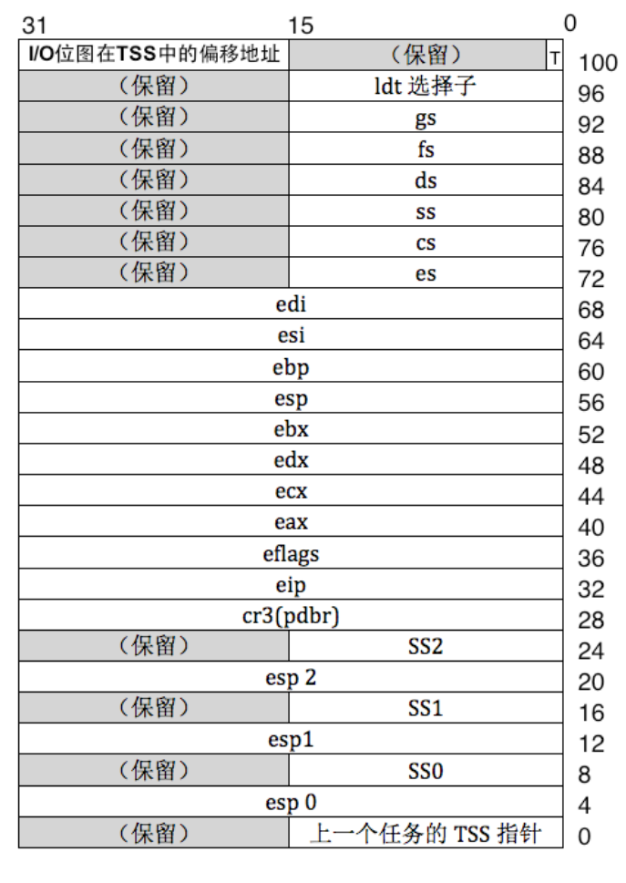
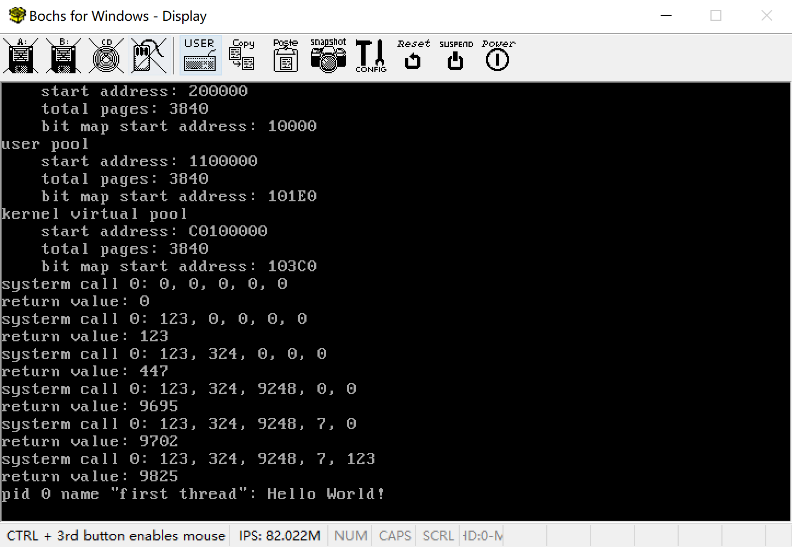
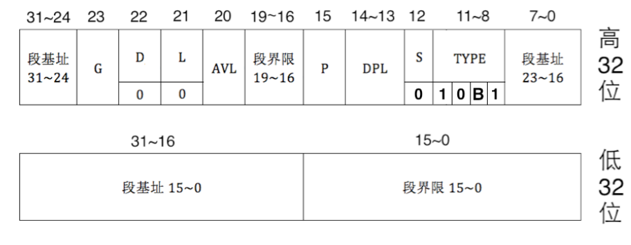
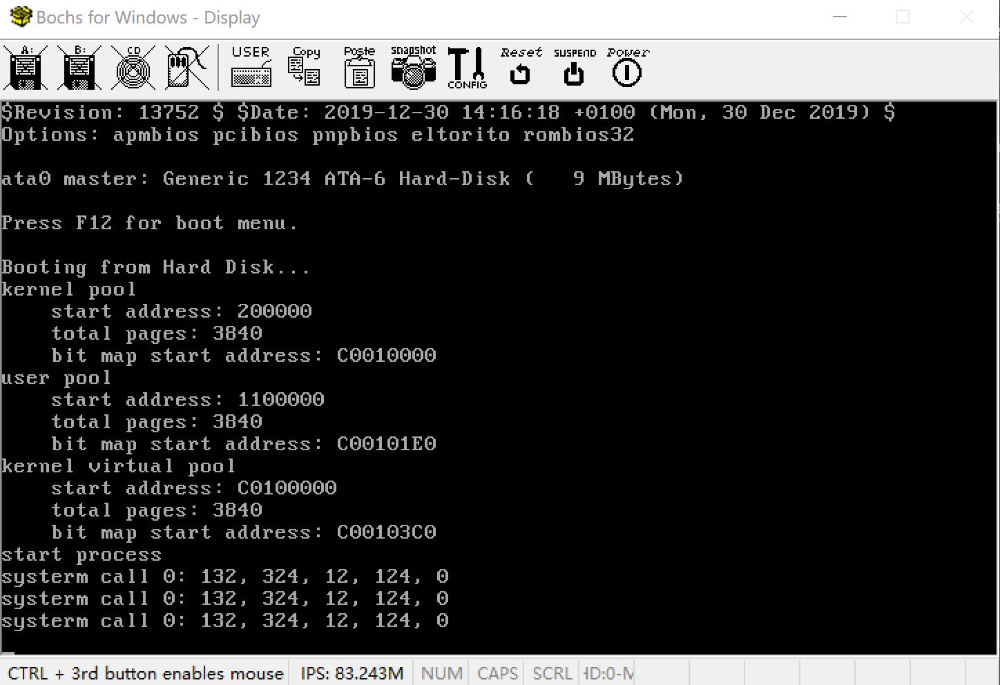

# 第6章 从内核态到用户态

> 仰之弥高，钻之弥坚，瞻之在前，忽焉在后。

[toc]

# 写在前面

在本节中，同学们将会学习到如下知识。

+ 学习保护模式特权级的基本概念。
+ 学习系统调用的实现。
+ 学习TSS。
+ 学习用户进程的实现。
+ 学习实现特权级转移。

# 浅谈特权级

在本章中，我们将会实现从内核态到用户态和用户态到内核态的转移。实际上，内核态和用户态只是两种特权级0和3的别名而已。在CPU中，CPU可以识别的特权级只有4个，0，1，2，3。其中，从0到3，特权级依次降低。在我们的实验中只会用到两个特权级，0和3，因此我们把CPU处在特权级0的状态称为内核态，把CPU处在特权级3的状态称为用户态。

为什么要区分内核态和用户态呢？因为我们的操作系统是支持多任务的，每一个任务都是一个独立的程序。如果我们任由这些程序能够使用特权代码，如访问硬件，修改其他任务的页目录表和页表，那么就会对系统的运行环境造成巨大的影响。因此，我们必须区分程序在什么环境下执行什么样的代码，例如只有当CPU处在内核态时才可以执行特权代码。

因此，当用户程序运行在用户态后，CPU无法执行特权代码。如果程序需要访问磁盘，那么程序首先需要进入内核态，然后CPU才能访问磁盘读写端口来访问磁盘，访问完毕后，CPU再从内核态返回到用户态。

实际上，内核态和用户态的划分是对程序访问资源的限制。代码是一种资源，数据和栈等也是一种资源。因此，内核态和用户态的划分也会对程序访问数据和栈造成限制。那么CPU是如何得知自己处于用户态还是内核态的呢？CPU又是如何知道哪些代码、数据和栈等资源是特权代码，不允许用户态程序访问，哪些资源又是允许用户访问的呢？这就涉及到CPL，RPL，DPL和特权级检查的内容了，如下所示。

+ RPL，Request Privilege Level，段选择子的低2位。
+ CPL，Current Privilege Level，也就是放入了CS寄存器的段选择子的RPL，CPL标识了CPU处在内核态还是用户态。
+ DPL，Descriptor Privilege Level，位于每一个段描述符中。
+  一致性代码段，简单理解，就是操作系统拿出来被共享的代码段，是可以被低特权级的用户直接调用访问的代码。在访问前后，特权级不会改变，用户态还是用户态，所以被称为一致的。
+ 非一致代码段，为了避免低特权级的访问而被操作系统保护起来的系统代码，只允许同级间访问，绝对禁止不同级访问，核心态不用用户态的资源，用户态也不使用核心态的资源。

因此，特权级检查如下。

+ 对于数据段和栈段，访问前进行特权级检查，要求$DPL \ge \max\{CPL, RPL\}$。
+ 对于代码段，如果是一致性代码段，要求$CPL\ge DPL$；对于非一致性代码段，要求$CPL=DPL$,$CPL\ge RPL$。

当我们想要从内核态进入用户态，或从用户态进入内核态时，我们就要进行特权级转移。特权级转移有两种方式，如下所示。

+ 从低特权级向高特权级转移。从低特权级向高特权级转移是通过中断，调用等方式来实现的，但这里我们只使用中断的方式来实现特权级转移。程序通过使用`int`指令来调用指定的中断，然后中断描述符中的代码段选择子会被加载到CS寄存器中，从而改变了CPL，实现特权级转移。
+ 从高特权级向低特权级转移。从高特权级转移向低特权级转移只能通过中断返回和调用返回来实现。

CPU在不同特权级下会使用不同的栈，当CPU使用中断从低特权级向高特权级转移的时候，CPU首先会将高特权级栈的段选择子和栈指针送入SS，ESP，然后将中断发生前的SS，ESP，EFLAGS、CS、EIP依次压入高特权级栈。不同特权级栈的选择子和段指针是保存在TSS(Task State Segment)中的，如下所示。



注意，TSS中只会保存特权级0，1，2的段选择子和栈指针，因为没有比特权级3更低的特权级向其转移。TSS的作用不只是用于保存不同特权级栈的信息外，实际上CPU提供了原生的多任务切换机制，TSS是使用来保存任务切换时任务的状态的，也就是说，每一个任务都有一个TSS。但我们并不使用这个原生的机制，进程的状态被保存在PCB中。

但是，当高特权级向低特权级转移时，我们并不需要给出低特权级栈的信息。因为CPU是禁止高特权级向低特权级转移的，只有一种情况除外，就是中断返回或任务返回，`iret`和`retf`。因此，CPU默认高特权级向低特权级转移的情况是中断或调用处理完成，然后返回，那么低特权级栈的信息在进入中断前被保存在高特权级栈中，因此返回后就可以恢复低特权级栈的SS和ESP。

关于特权级的事情我们就点到为止，但也足够我们去实现用户进程和进程切换了。

# 系统调用的实现

操作系统为了限制程序访问特权资源，于是将程序的执行限制在特权级3下，称为用户态。但是，操作系统会向程序提供一系列服务的约定，如访问磁盘、内存分配和输入输出等。此时，为了使用这些服务，程序需要通过中断、调用等方式从用户态进入内核态，由操作系统内核来完成这些服务，然后再从内核态返回用户态，最后得到服务的结果。整个过程被称为系统调用，system call。

在第2章中，在代码段、数据段和栈段的段描述符中，我们将DPL设置为0，因此这几个段也就是特权资源所在的段了。注意我们将这几个段设置为非一致性代码段。而非一致代码段要求CPL=DPL才能访问代码段。因此，当我们需要访问非一致代码段时，要求CPL=0。注意到我们的进程运行时的CPL=3，因此当我们从用户态进入内核态时，需要进行特权级转移，将RPL=0的段选择子送入CS。这里，我们使用中断来实现特权级转移。此时，在我们的系统中，系统调用就是调用软中断，中断处理和中断返回的过程。

我们现在来看看如何使用中断来实现系统调用。

# Assignment 1 第一个系统调用

首先，系统调用的函数声明如下。

```cpp
extern "C" int asm_system_call(int index, int first = 0, int second = 0, int third = 0, int forth = 0, int fifth = 0);
```

系统调用是操作系统向用户程序提供的一系列服务的约定，实际上这些服务就是一个个的能够处理用户程序不同系统调用的函数。这些函数的地址被统一放在系统调用表(system call table)中，函数参数`index`是用户程序希望调用的系统调用号，系统调用号是由操作系统向用户程序提供的。实际上，系统调用号就是处理系统调用的函数在系统调用表中的位置。

我们后面会知道，我们使用中断来进行系统调用时，系统调用的参数是放在5个寄存器当中的，因此系统调用的参数不可以超过5个。但是，为什么不放在栈上面呢？这是因为用户程序使用系统调用时会进行特权级转移，此时进入系统调用后，CPU使用的栈是高特权级的栈，而我们在放置参数的栈是低特权级的栈，因此CPU可能会找不到函数的参数。为了简便起见，我们就将系统调用的参数通过寄存器来传递。

这个函数是通过汇编来实现的，如下所示。

```asm
asm_system_call:
    push ebp
    mov ebp, esp

    pushad
    push ds
    push es
    push fs
    push gs

    mov eax, [ebp + 2 * 4]
    mov ebx, [ebp + 3 * 4]
    mov ecx, [ebp + 4 * 4]
    mov edx, [ebp + 5 * 4]
    mov esi, [ebp + 6 * 4]
    mov edi, [ebp + 7 * 4]

    int 0x80
    mov [ASM_TEMP], eax

    pop gs
    pop fs
    pop es
    pop ds
    popad

    pop ebp

    mov eax, [ASM_TEMP]
    ret
```

系统调用的中断向量号是`0x80`。在调用中断前，我们先保护现场，将系统调用的参数放到5个寄存器ebx, ecx, edx, esi, edi中，将系统调用号放到eax中，然后使用指令`int 0x80`调用`0x80`中断。中断返回后，根据C语言函数调用规则，函数的返回值是放在eax中的，由于后面的`popad`指令会影响eax，因此我们先将eax保存在`dd`类型的变量`ASM_TEMP`中，如下所示。

```asm
ASM_TEMP dd 0
```

恢复现场后再恢复eax，最后返回即可。

然后，我们创建一个管理系统调用的类`SystemService`，如下所示，代码放在`syscall.h`中。

```cpp
#ifndef SYSCALL_H
#define SYSCALL_H

#include "os_constant.h"

class SystemService
{
public:
    SystemService();
    void initialize();
    // 设置系统调用，index=系统调用号，function=处理第index个系统调用函数的地址
    bool setSystemCall(int index, int function);
};

// 第0个系统调用
int syscall_0(int first, int second, int third, int forth, int fifth);

#endif
```

其中，`syscall_0`是我们第一个系统调用，其作用是打印输入的5个参数，然后将它们加起来返回。同样地，我们在`os_modules.h`中创建它的实例。

```cpp
#ifndef OS_MODULES_H
#define OS_MODULES_H

#include "interrupt.h"
#include "stdio.h"
#include "memory.h"
#include "program.h"
#include "syscall.h"

// 中断管理器
InterruptManager interruptManager;
// 输出管理器
STDIO stdio;
// 内存管理器
MemoryManager memoryManager;
// 进程/线程管理器
ProgramManager programManager;
// 系统调用
SystemService systemService;

#endif
```

在用户程序使用系统调用之前，我们首先要对系统调用表进行初始化。其次，由于我们的系统调用是通过0x80号中断来完成的，我们加入0x80中断对应的中断描述符。如下所示，代码放置在`src/kernel/syscall.cpp`中。

```cpp
void SystemService::initialize()
{
    memset((char *)system_call_table, 0, sizeof(int) * MAX_SYSTEM_CALL);
    // 代码段选择子默认是DPL=0的平坦模式代码段选择子，DPL=3，否则用户态程序无法使用该中断描述符
    interruptManager.setInterruptDescriptor(0x80, (uint32)asm_system_call_handler, 3);
}
```

我们已经知道，每一个系统调用号都有一个处理这个系统调用的函数，实际上就是操作系统向用户程序提供的服务的约定。这些系统调用的函数被统一放在系统调用表中，如下所示。

```cpp
int system_call_table[MAX_SYSTEM_CALL];
```

`system_call_table`的每一个元素是系统调用的处理函数的地址。

我们希望通过0x80中断从特权级3(用户态)到特权级0(内核态)转移，中断描述符中的代码段选择子的RPL=0，注意到`InterruptManager::setInterruptDescriptor`默认中断描述符的代码段选择子是DPL=0的平坦模式代码段选择子，因此我们直接调用这个函数设置中断描述符即可。注意，我们需要设置中断描述符的DPL=3，否则会由于特权级保护导致用户程序无法使用这个中断。

`asm_system_call_handler`是0x80号中断的处理函数，如下所示。

```asm
; int asm_systerm_call_handler();
asm_system_call_handler:
    push eax

    ; 栈段会从tss中自动加载

    mov eax, DATA_SELECTOR
    mov ds, eax
    mov es, eax

    mov eax, VIDEO_SELECTOR
    mov gs, eax

    pop eax

    ; 参数压栈
    push edi
    push esi
    push edx
    push ecx
    push ebx

    sti    
    call dword[system_call_table + eax * 4]
    cli

    add esp, 5 * 4

    iret
```

实际的系统调用处理函数是通过C语言来实现的。但是，由于中断发生后只是更改了cs寄存器，ds，es，fs和gs寄存器并未修改，因此在调用这些使用C语言实现的系统调用之前，我们需要手动修改这些段寄存器。然后，我们将保存在5个寄存器当中的系统调用函数压栈，然后开中断，调用系统调用处理的函数。注意，系统调用号是保存在eax中的，`system_call_table`保存的是系统调用处理函数的地址，每一个元素占4个字节。因此`[system_call_table + eax * 4]`就是系统调用号对应的系统调用处理函数的地址。

系统调用处理函数返回后，函数的返回值会放在eax中，然后我们修改esp寄存器，中断返回即可。

然后我们加入系统调用号为0的系统调用，如下所示。

```cpp
int syscall_0(int first, int second, int third, int forth, int fifth)
{
    printf("systerm call 0: %d, %d, %d, %d, %d\n",
           first, second, third, forth, fifth);
    return first + second + third + forth + fifth;
}
```

在`setup_kernel.cpp`中设置系统调用号为0的系统调用处理函数，然后调用之，如下所示。

```cpp
extern "C" void setup_kernel()
{
	...

    // 初始化系统调用
    systemService.initialize();
    systemService.setSystemCall(0, (int)syscall_0);

    int ret;

    ret = asm_system_call(0);
    printf("return value: %d\n", ret);

    ret = asm_system_call(0, 123);
    printf("return value: %d\n", ret);

    ret = asm_system_call(0, 123, 324);
    printf("return value: %d\n", ret);

    ret = asm_system_call(0, 123, 324, 9248);
    printf("return value: %d\n", ret);

    ret = asm_system_call(0, 123, 324, 9248, 7);
    printf("return value: %d\n", ret);

    ret = asm_system_call(0, 123, 324, 9248, 7, 123);
    printf("return value: %d\n", ret);
	
    ...
}

```

编译运行，输出如下结果。



此时，我们便实现了系统调用，接下来我们创建进程。

# 进程的实现

## 进程创建前的准备

在第5章中我们提到，用户进程和内核线程最大的区别在于用户进程有自己的虚拟地址空间，而内核线程使用的是内核虚拟地址空间。从C语言程序的角度来看，每一个进程都是一个个包含了main函数的程序的执行体，虚拟地址从0开始，可以寻址到4GB的地址空间。但是，我们知道，我们将内核的0\~1MB的虚拟地址对应到物理地址的0\~1MB，倘若用户进程虚拟地址也是从0开始，那么不就与内核冲突了吗？其实不会的，奥秘就在于分页机制的使用。分页机制实际上就是一种多对一的映射关系，在不同的映射关系下，即使对于相同的虚拟地址，我们的页目录表和页表不同，那么CPU在寻址过程中得到的物理地址也就会不同。实际上，和内核一样，每一个进程都会有自己独立的页目录表和页表，在进程切换之后，页目录表也会随之切换。此时，即使是切换前后相同的虚拟地址，最终也可能得到不同的物理地址。

但是有时候，进程有不得不使用内核的资源，如在时钟中断阶段，我们需要调用`programmerManager.schedule()`来进行进程切换。此时，`programmerManager`的虚拟地址是0\~1MB，和进程的虚拟地址冲突了，说明进程无法找到处在虚拟地址0\~1MB的`programmerManager`。我们的解决方案是，由于每一个进程都含有0\~4GB的虚拟地址空间，对每一个进程，我们单独地划分出3\~4GB的虚拟地址空间来作为共享的内核区域。然后通过分页机制，巧妙地将这部分虚拟地址变换到和虚拟地址0\~1MB相同的物理地址上，从而使得进程也能访问到内核的资源。

由于3\~4GB对应到页目录表的第768\~1023个页目录项，我们只要简单地使第0个页目录项和第768个页目录项相等，第1个页目录项和第769个页目录项相等，依次类推。而我们的内核很小，足以放在0\~1MB的内存当中，因此只要第0个页目录项和第768个页目录项相等即可。这就是我们在开启分页机制的函数最后所作的工作。此时，对于一个处在0\~1MB的虚拟地址`virutal`，其和`virtual+0xc0000000`的寻址结果相同。此时，我们便实现了在不占用进程0\~1MB的虚拟地址的前提下访问处于内核虚拟地址0\~1MB的资源。

注意，在进程中，我们是直接使用变量名`programmerManager`来访问其成员函数的，而程序在编译后的地址默认是相对于0的偏移地址。此时，为了使进程能够对`programmerManager`进行正确寻址，我们需要在链接时指定代码中的变量是相对于`0xc0000000`偏移的，我们将makefile修改如下。

```makefile
kernel.bin : $(OBJ)
	@$(LINKER) -o kernel.bin -melf_i386 -N entry.obj $(OBJ) -Ttext 0xc0020000 --oformat binary
```

其中，`-Ttext`参数本来是`0x20000`，现在我们将其提升到3GB的空间。

虽然内核的变量被提升到了3GB以上的空间，但我们实际上加载内核还是加载到`0x20000`处，只不过通过分页机制将3GB以上的虚拟地址空间映射到0\~1MB的空间。因此，为了能够让CPU能够正确寻址，我们需要在跳转到内核之前就开启分页机制，也就是在bootloader中完成这个过程，如下所示。

我们先将开启分页机制的函数单独地放到`src/boot/page.cpp`中，如下所示。

```cpp
#include "os_constant.h"

extern "C" void open_page_mechanism()
{
    // 页目录表指针
    int *directory = (int *)PAGE_DIRECTORY;
    //线性地址0~4MB对应的页表
    int *page = (int *)(PAGE_DIRECTORY + PAGE_SIZE);
    int amount = PAGE_SIZE / 4;

    // 初始化页目录表
    for (int i = 0; i < amount; ++i)
    {
        directory[0] = 0;
        page[0] = 0;
    }

    int address = 0;
    // 将线性地址0~1MB恒等映射到物理地址0~1MB
    for (int i = 0; i < 256; ++i)
    {
        // U/S = 1, R/W = 1, P = 1
        page[i] = address | 0x7;
        address += PAGE_SIZE;
    }

    // 初始化页目录项

    // 0~1MB
    directory[0] = ((int)page) | 0x07;
    // 3GB的内核空间
    directory[768] = directory[0];
    // 最后一个页目录项指向页目录表
    directory[1023] = ((int)directory) | 0x7;
}
```

然后在bootloader中调用这个函数来开启分页机制。

```asm
...
call open_page_mechanism

mov eax, PAGE_DIRECTORY
mov cr3, eax ; 放入页目录表地址
mov eax, cr0
or eax, 0x80000000
mov cr0, eax           ; 置PG=1，开启分页机制

sgdt [pgdt]
add dword[pgdt + 2], 0xc0000000
lgdt [pgdt]

jmp dword CODE_SELECTOR:KERNEL_VIRTUAL_ADDRESS    ; 跳转到kernel
...
```

注意，我们将内核提升到3GB空间后，之前保存在GDTR的GDT地址还是位于0\~1MB的空间，因此我们要将其加上偏移量`0xc0000000`，然后再送入到GDTR中。否则，进程运行时无法找到段描述符导致出错。

最后我们跳转到`KERNEL_VIRTUAL_ADDRESS`，如下所示。

```cpp
; __________kernel_________
KERNEL_START_SECTOR equ 6
KERNEL_SECTOR_COUNT equ 145
KERNEL_START_ADDRESS equ 0x20000
KERNEL_VIRTUAL_ADDRESS equ 0xc0020000
```

注意，内核加载的物理地址还是`KERNEL_START_ADDRESS`，如下所示。

```asm
mov eax, KERNEL_START_SECTOR
mov ebx, KERNEL_START_ADDRESS
mov ecx, KERNEL_SECTOR_COUNT

load_kernel: 
    push eax
    push ebx
    call asm_read_hard_disk  ; 读取硬盘
    add esp, 8
    inc eax
    add ebx, 512
    loop load_kernel
```

最后我们修改一下makefile中生成bootloader.bin的代码。

```makefile
bootloader.bin : $(SRCDIR)/boot/bootloader.asm 
	@$(ASM_COMPILER) -o bootloader.o -f elf32 -I$(INCLUDE_PATH)/ $(SRCDIR)/boot/bootloader.asm
	@$(CXX_COMPLIER) -o page.o $(CXX_COMPLIER_FLAGS) -I$(INCLUDE_PATH) -c $(SRCDIR)/boot/page.cpp
	@$(LINKER) -o bootloader.bin -melf_i386 -N  bootloader.o page.o -Ttext 0x0 --oformat binary
	@rm -f bootloader.o page.o
```

我们将`os_constant.h`中的地址也提升到3GB以上的空间。

```cpp
#ifndef OS_CONSTANT_H
#define OS_CONSTANT_H

#define IDT_START_ADDRESS 0xc0008880

...
    
#define BITMAP_START_ADDRESS 0xc0010000
#define KERNEL_VIRTUAL_START 0xc0100000

...

#endif
```

然后我们将显存访问地址提升到3GB以上的空间。

```cpp
void STDIO::initialize()
{
    screen = (uint8 *)0xc00b8000;
}
```

最后编译运行即可，此时我们就完成了进程创建前的准备，我们接下来初始化TSS。

## 初始化TSS和用户段描述符

由于进程的运行环境需要用到TSS，特权级3下的平坦模式代码段和数据段描述符，我们现在来将其初始化，如下所示。

```cpp
void ProgramManager::initialize()
{
    allPrograms.initialize();
    readyPrograms.initialize();
    running = nullptr;

    int selector;
    selector = asm_add_global_descriptor(USER_CODE_LOW, USER_CODE_HIGH);
    USER_CODE_SELECTOR = (selector << 3) | 0x3;

    selector = asm_add_global_descriptor(USER_DATA_LOW, USER_DATA_HIGH);
    USER_DATA_SELECTOR = (selector << 3) | 0x3;
    
    selector = asm_add_global_descriptor(USER_STACK_LOW, USER_STACK_HIGH);
    USER_STACK_SELECTOR = (selector << 3) | 0x3;


    initializeTSS();
}
```

首先，我们向GDT中新增用户代码段描述符，数据段描述符和栈段描述符，这几个描述符和之前的不同之处仅在于我们将DPL修改为3，如下所示。

```cpp
#define USER_CODE_LOW 0x0000ffff
#define USER_CODE_HIGH 0x00cff800

#define USER_DATA_LOW 0x0000ffff
#define USER_DATA_HIGH 0x00cff200

#define USER_STACK_LOW 0x0
#define USER_STACK_HIGH 0x0040f600
```

然后我们将这个几个段描述符送入GDT，如下所示。

```cpp
asm_add_global_descriptor:
    push ebp
    mov ebp, esp

    push ebx
    push esi

    sgdt [ASM_GDTR]
    mov ebx, [ASM_GDTR + 2] ; GDT地址
    xor esi, esi
    mov si, word[ASM_GDTR] ; GDT界限
    add esi, 1

    mov eax, [ebp + 2 * 4] ; low
    mov dword [ebx + esi], eax
    mov eax, [ebp + 3 * 4] ; high
    mov dword [ebx + esi + 4], eax

    mov eax, esi
    shr eax, 3

    add word[ASM_GDTR], 8
    lgdt [ASM_GDTR]

    pop esi
    pop ebx
    pop ebp

    ret
```

`asm_add_global_descriptor`先读入GDTR的内容，然后找到GDT的起始地址和偏移地址，然后在GDT的末尾新增一个段描述符，最后再将GDT的界限增加8并更新GDTR，返回新增的段描述符的位置。

最后，为了使加载这几个段描述符后CPL=3，我们设置这几个段的段选择子的RPL=3，接下来我们初始化TSS。

当我们从低特权级向高特权级转移时，CPU首先会在TSS中找到高特权级栈的段选择子和栈指针，然后送入SS，ESP，接着将中断发生前的SS，ESP，EFLAGS、CS、EIP依次压入高特权级栈。本来TSS是用于CPU原生的进程切换的状态保存器，但我并不打算使用这套方案。因此，TSS的作用仅限于向CPU提供进程特权级转移时的栈段选择子和栈指针。

我们创建一个TSS的结构体，如下所示，代码保存在`include/tss.h`中。

```cpp
#ifndef TSS_H
#define TSS_H

struct TSS
{
public:
    int backlink;
    int esp0;
    int ss0;
    int esp1;
    int ss1;
    int esp2;
    int ss2;
    int cr3;
    int eip;
    int eflags;
    int eax;
    int ecx;
    int edx;
    int ebx;
    int esp;
    int ebp;
    int esi;
    int edi;
    int es;
    int cs;
    int ss;
    int ds;
    int fs;
    int gs;
    int ldt;
    int trace;
    int ioMap;
};
#endif
```

注意，TSS的内容必须如此安排，否则CPU在自动加载TSS的时候会加载到错误的数据。然后我们在`include/os_modules.h`中定义这个TSS的实例，如下所示。

```cpp
#ifndef OS_MODULES_H
#define OS_MODULES_H

...
    
// TSS
TSS tss;

#endif
```

TSS 和其他段一样，本质上是一片存储数据的内存区域， Intel本来是想让操作系统使用这片内存区域保存任务的最新状态，因此它也像其他段那样，有对应的段描述符，称为TSS 描述符，如下所示。

  

这里，段基址的意思是TSS的起始地址，即`&tss`，段界限是TSS的实际长度减1，即`sizeof(TSS)-1`，其他的字段含义和普通的段描述符相同。

CPU是在特权级转移的时候自动加载TSS的内容的，因此CPU需要有一个地方来保存TSS描述符的选择子，以便于自动加载，也就是TR寄存器。我们使用`ltr`将TSS的段选择子送入TR即可。

此时，TSS的初始化如下。

```cpp
void ProgramManager::initializeTSS()
{

    int size = sizeof(TSS);
    int address = (int)&tss;

    memset((char *)address, 0, size);
    tss.ss0 = STACK_SELECTOR; // 内核态堆栈段选择子

    int low, high, limit;

    limit = size - 1;
    low = (address << 16) | (limit & 0xff);
    // DPL = 0
    high = (address & 0xff000000) | ((address & 0x00ff0000) >> 16) | ((limit & 0xff00) << 16) | 0x00008900;

    int selector = asm_add_global_descriptor(low, high);
    // RPL = 0
    asm_ltr(selector << 3);
    tss.ioMap = address + size;
}
```

接下来，我们便可以正式创建进程了。

## 进程的创建

进程和线程使用了PCB来保存其基本信息，如pid，栈等。但是，进程和线程的区别在于进程有自己的虚拟地址空间和相应的分页机制，也就是虚拟地址池和页目录表。我们先在PCB中新增如下内容。

```cpp
struct PCB
{
	...
    int pageDirectoryAddress;            // 页目录表地址
    AddressPool userVirtual;             // 用户程序虚拟地址池
};
```

然后我们开始创建进程。

```cpp
int ProgramManager::executeProcess(const char *filename, int priority)
{
    bool status = interruptManager.getInterruptStatus();
    interruptManager.disableInterrupt();

    int pid = executeThread((ThreadFunction)load_process, (void *)filename, filename, priority);
    if (pid == -1)
    {
        interruptManager.setInterruptStatus(status);
        return -1;
    }

    PCB *process = ListItem2PCB(allPrograms.back());

    process->pageDirectoryAddress = createProcessPageDirectory();
    if (process->pageDirectoryAddress)
    {
        process->status = ThreadStatus::DEAD;
        return -1;
    }

    bool res = createUserVirtualPool(process);

    if (!res)
    {
        process->status = ThreadStatus::DEAD;
        return -1;
    }

    interruptManager.setInterruptStatus(status);

    return pid;
}

```

这里我们先像创建一个线程一样创建进程的PCB，这里，创建线程的参数并不是进程的起始地址，而是加载进程的函数，这个我们后面再分析。如果进程创建失败，我们只要简单地将其标记为`DEAD`即可。

接着我们为进程创建页目录表，如下所示。

```cpp
int ProgramManager::createProcessPageDirectory()
{
    int vaddr = memoryManager.allocatePages(AddressPoolType::KERNEL, 1);
    if (!vaddr)
    {
        //printf("can not create page from kernel\n");
        return 0;
    }

    memset((char *)vaddr, 0, PAGE_SIZE);

    // 复制内核目录项到虚拟地址的高1GB
    int *src = (int *)(0xfffff000 + 0x300 * 4);
    int *dst = (int *)(vaddr + 0x300 * 4);
    for (int i = 0; i < 256; ++i)
    {
        dst[i] = src[i];
    }

    // 最后一项设置为用户进程页目录表物理地址
    ((int *)vaddr)[1023] = memoryManager.vaddr2paddr(vaddr) | 0x7;
    return vaddr;
}
```

首先，进程的页目录表是从内核中分配的，而分配的页的虚拟地址已经被提升到3GB以上的空间。为了使进程能够访问这份部分地址，我们需要将内核的第768\~1022个页目录项复制到进程的页目录表的相同位置。然后我们将最后一个页目录项指向用户进程页目录表物理地址，这是为了后面的内容服务，我们留到下卷再讨论:smile:

最后，我们为进程创建虚拟地址池，如下所示。

```cpp
bool ProgramManager::createUserVirtualPool(PCB *process)
{
    int sourcesCount = (0xc0000000 - USER_VADDR_START) / PAGE_SIZE;
    int bitmapLength = ceil(sourcesCount, 8);

    // 计算位图所占的页数
    int pagesCount = ceil(bitmapLength, PAGE_SIZE);

    int start = memoryManager.allocatePages(AddressPoolType::KERNEL, pagesCount);

    if (!start)
    {
        return false;
    }

    memset((char *)start, 0, PAGE_SIZE * pagesCount);
    (process->userVirtual).initialize((char *)start, bitmapLength, USER_VADDR_START);

    return true;
}
```

这里，我们将进程的虚拟地址的起始位置定义在`USER_VADDR_START`到3GB，这是仿照linux的做法。然后我们计算这部分地址所占的页表的数量，从而计算出为了管理这部分地址所需的位图大小。然后，我们在内核空间中为进程分配位图所需的内存。

至此，进程的创建已经完成，我们现在来看`load_process`的作用。

进程就是程序的执行体。程序是放置在磁盘上的，当我们需要运行程序时，就需要为程序加载到内存，创建PCB和页目录表，然后被调度执行。但是，我们还没有实现文件系统，因此我们只是简单地给出进程要跳转执行的地址、创建PCB和页目录表。因此，和线程一样，filename是某个函数的地址。但同学们应该注意到，这二者实际上是等价的。

当进程的PCB被首次加载到处理器执行时，CPU首先会进入`load_process`，`load_process`如下所示。

```cpp
void load_process(const char *filename)
{
    interruptManager.disableInterrupt();

    PCB *process = programManager.running;
    ProcessStartStack *interruptStack = (ProcessStartStack *)((int)process + PAGE_SIZE - sizeof(ProcessStartStack));

    interruptStack->edi = 0;
    interruptStack->esi = 0;
    interruptStack->ebp = 0;
    interruptStack->esp_dummy = 0;
    interruptStack->ebx = 0;
    interruptStack->edx = 0;
    interruptStack->ecx = 0;
    interruptStack->eax = 0;
    interruptStack->gs = 0;
    
    interruptStack->fs = programManager.USER_DATA_SELECTOR;
    interruptStack->es = programManager.USER_DATA_SELECTOR;
    interruptStack->ds = programManager.USER_DATA_SELECTOR;

    interruptStack->eip = (int)filename;
    interruptStack->cs = programManager.USER_CODE_SELECTOR;   // 用户模式平坦模式
    interruptStack->eflags = (0 << 12) | (1 << 9) | (1 << 1); // IOPL, IF = 1 开中断, MBS = 1 默认

    interruptStack->esp = memoryManager.allocatePages(AddressPoolType::USER, 1);
    if (interruptStack->esp == 0)
    {
        printf("can not build process!\n");
        process->status = ThreadStatus::DEAD;
        asm_halt();
    }
    interruptStack->esp += PAGE_SIZE;
    interruptStack->ss = programManager.USER_STACK_SELECTOR;

    asm_start_process((int)interruptStack);
}
```

首先我们关中断，然后初始化启动进程需要的栈结构。注意，我们在创建PCB的时候预留了这部分内存，如下所示。

```cpp
int ProgramManager::executeThread(ThreadFunction function, void *parameter, const char *name, int priority)
{
...
    // 线程栈
    thread->stack = (int *)((int)thread + PAGE_SIZE - sizeof(ProcessStartStack));
    
...
}
```

这个栈结构如下。

```cpp
struct ProcessStartStack
{
    int edi;
    int esi;
    int ebp;
    int esp_dummy;
    int ebx;
    int edx;
    int ecx;
    int eax;
    
    int gs;
    int fs;
    int es;
    int ds;

    int eip;
    int cs;
    int eflags;
    int esp;
    int ss;
};
```

`ProcessStartStack`内容的安排和我们后面使用中断返回来启动进程是密不可分的，然后我们初始化`ProcessStartStack`。

注意，进程是运行在特权级3下的，每一个特权级都有自己的栈。因此在最后，我们在进程虚拟地址空间中分配一页来作为进程的特权级3栈。我们后面可以看到，进程的特权级0栈在进程的PCB中。在此之前，我们需要页内存分配的函数稍作修改，使得我们可以分配和释放用户空间的页内存。

```cpp
int MemoryManager::allocateVirtualPages(enum AddressPoolType type, const int count)
{
    int start = -1;

    if (type == AddressPoolType::KERNEL)
    {
        start = kernelVirtual.allocate(count);
    } else if (type == AddressPoolType::USER){
        start = programManager.running->userVirtual.allocate(count);
    }

    return (start == -1) ? 0 : start;
}

void MemoryManager::releaseVirtualPages(enum AddressPoolType type, const int vaddr, const int count)
{
    if (type == AddressPoolType::KERNEL)
    {
        kernelVirtual.release(vaddr, count);
    }
    else if (type == AddressPoolType::UESR)
    {
        programManager.running->userVirtual.release(vaddr, count);
    }
}
```

然后我们定义进程启动时的`eflags`结构，我们将IOPL设置为0，意味着进程无法直接访问IO端口，由此实现用户态程序无法自由地访问硬件。

最后，我们通过中断返回来启动进程，如下所示。

```asm
asm_start_process:
    ;jmp $
    mov eax, dword[esp+4]
    mov esp, eax
    popad
    pop gs;
    pop fs;
    pop es;
    pop ds;

    iret
```

我们将`ProcessStartStack`的起始地址送入了esp，然后通过一系列的pop指令和iret语句更新寄存器，最后中断返回后，特权级3的选择子被段寄存器中，然后跳转到进程的起始代码处执行。

至此，我们便完成了进程的启动，实现了从内核态到用户态的变化。

# 进程的调度

我们接下来完成进程的调度部份，进程的调度只需要在原先的线程调度的基础上加入如下部份。

+ 切换页目录表。
+ 更新TSS中的特权级0的栈。

如下所示。

```cpp
void ProgramManager::schedule()
{
     ...
         
    activateProgramPage(next);

    asm_switch_thread(cur, next);

    interruptManager.setInterruptStatus(status);
}

void ProgramManager::activateProgramPage(PCB *program)
{
    int paddr = PAGE_DIRECTORY;

    if (program->pageDirectoryAddress)
    {
        updateESP0(program);
        paddr = memoryManager.vaddr2paddr(program->pageDirectoryAddress);
    }

    asm_update_cr3(paddr);
}

void ProgramManager::updateESP0(PCB *process)
{
    // 0特权级栈在PCB中
    tss.esp0 = (int)process + PAGE_SIZE;
}
```

比较简单，我便不再赘述。

至此，我们已经实现了用户进程，我们接下来使用之。

> 特别注意，我们还没有实现进程的返回，因此我们需要在进程的结束处加入死循环来阻止进程返回。

# Assignment 2 第一个进程

我们创建第一个进程，这个进程会调用之前的系统调用0，如下所示。

```cpp
void first_process()
{
    asm_system_call(0, 132, 324, 12, 124);
    asm_halt();
}

void first_thread(void *arg)
{
    printf("start process\n");
    programManager.executeProcess((const char *)first_process, 1);
    programManager.executeProcess((const char *)first_process, 1);
    programManager.executeProcess((const char *)first_process, 1);
    asm_halt();
}

extern "C" void setup_kernel()
{
    // 中断管理器
    interruptManager.initialize();
    interruptManager.enableTimeInterrupt();
    interruptManager.setTimeInterrupt((void *)asm_time_interrupt_handler);

    // 输出管理器
    stdio.initialize();

    // 内存管理器
    //memoryManager.openPageMechanism();
    memoryManager.initialize(32 * 1024 * 1024);

    // 进程/线程管理器
    programManager.initialize();

    // 初始化系统调用
    systemService.initialize();
    systemService.setSystemCall(0, (int)syscall_0);
    systemService.setSystemCall(1, (int)syscall_write);

    // 创建第一个线程
    int pid = programManager.executeThread(first_thread, nullptr, "first thread", 1);
    if (pid == -1)
    {
        printf("can not execute thread\n");
        asm_halt();
    }

    ListItem *item = programManager.readyPrograms.front();
    PCB *firstThread = programManager.ListItem2PCB(item);
    firstThread->status = RUNNING;
    programManager.readyPrograms.pop_front();
    programManager.running = firstThread;
    asm_switch_thread(0, firstThread);

    asm_halt();
}

```

然后编译运行，输出如下信息。



至此，我们成功地实现了用户进程。

# Assignment 3 printf的改造

由于我们设置了进程的IOPL=0，进程无法在用户态下直接访问显存地址来进程输入输出，即在进程中，`printf`的形如`stdio.print`的语句无法被执行。

```cpp
int printf(const char *const fmt, ...)
{
    ...

            case 's':
                buffer[idx] = '\0';
                idx = 0;
                counter += stdio.print(buffer);
                counter += stdio.print(va_arg(ap, const char *));
                break;
    ...
}
```

为了能在进程中使用printf，同学们需要加入一个向屏幕输出的系统调用，然后将将直接访问显存的输出换成使用这个系统调用来输出。

> 本章字数最少，但综合了前面5章的全部知识，同学们注意仔细体会:sweat_smile:

# 练习

1. 系统调用的参数是否一定要放在栈上？是否可以使用栈来传递？
2. `load_process`开始关中断，但并没有开中断。请问后面启动进程后，为什么CPU可以响应时钟中断？
3. 请复现assignment 1。
4. 请复现assignment 2。
5. 请实现assignment 3。

# bonus

1. 实现信号量和锁机制。
2. 实现CPU原生的多任务切换。
3. 实现fork/exit/wait。
4. 实现一个文件系统。
5. 实现一个简易的shell。
6. 实现一个小游戏。