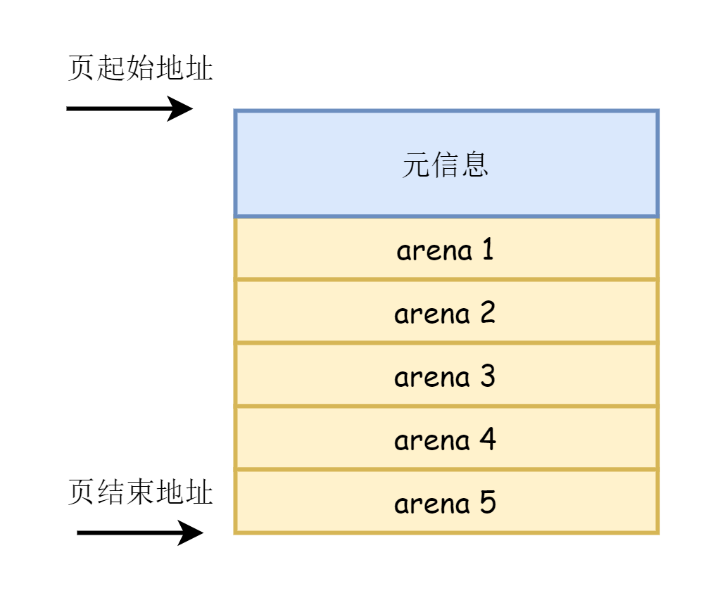
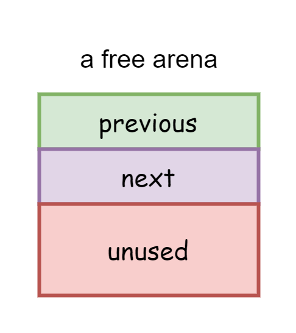
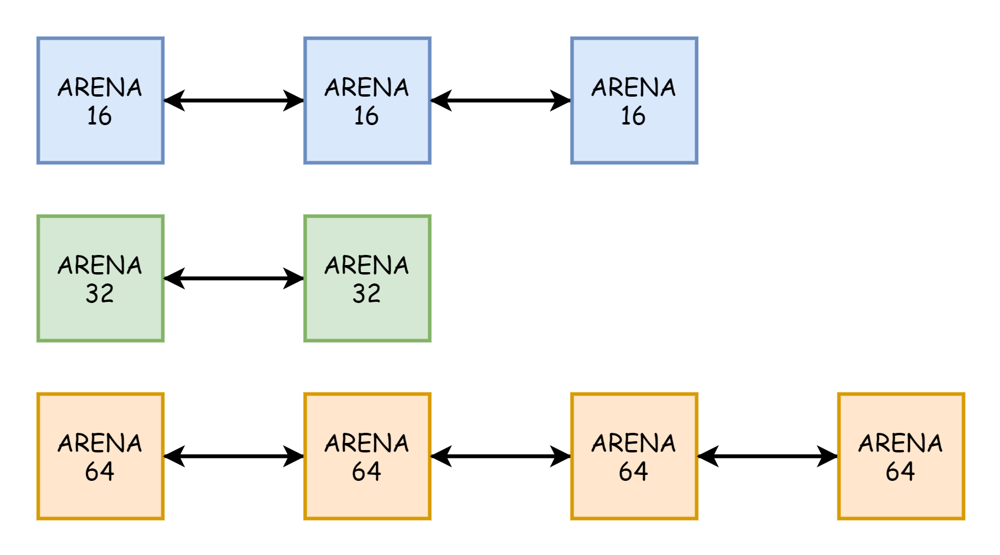

# 第八章 Course Projects

> 更喜岷山千里雪，三军过后尽开颜。

我们终于来到了本学期实验课的最后一次实验，在本章中，同学们可以从以下项目中选出若干个自己喜欢的项目来实现。

# 实验要求

> - DDL：2021年07月16号 23:59
> - 提交的内容：将**若干个project的代码**和**实验报告**放到**压缩包**中。压缩包命名为“**lab9-姓名-学号**”，并交到课程网站上[http://course.dds-sysu.tech/course/3/homework]
> - 不同的project的代码需要放在不同的文件夹下。

1. 实验不限语言， C/C++/Rust都可以。
2. 实验不限平台， Windows、Linux和MacOS等都可以。
3. 实验不限CPU， ARM/Intel/Risc-V都可以。

# 写在前面

+ **可以实现多个项目，项目的分数可以累加，上不封顶。超出lab9满分（100分）的部分会被折算到实验课的加分部分，但不会超过实验课的最大加分限制。**
+ **lab9不强求使用本教程提供的代码，可以在你自己的实现的操作系统上，ucore或者xv6的代码上实现相同的功能。因此，下面要求中“自己的操作系统”指的是你自己的实现的操作系统，ucore或者xv6等。由于在github上可以找到ucore或者xv6的相关功能的实现代码，若直接抄袭，则相应实现部分判零分。**

# Project 1 虚拟内存的完善

通过分页机制，我们实现了内存的虚拟化，从而使得程序可以看到比实际的物理内存更大的虚拟内存。虚拟内存另外一个重要的组成部分是页换入换出机制，页换入换出的解释如下。

当内存紧张的时候，我们不得不将一些物理页换出内存，存放到磁盘上，这被称为页的换出。当程序需要使用被换出的页时，程序会产生一个缺页中断。此时，缺页中断处理函数根据页面置换算法将其他某些页换出，然后将程序需要的页从磁盘加载到内存，并修改页表，使得页表重新指向被重新加载到内存的页。这个过程被称为页的换入。

为了简便起见，我们并没有实现页换入换出机制。现在，同学们需要在自己本学期的实验基础上，实现页换入换出机制。在实现了页换入换出机制后，同学们需要自行提供测例来测试页的换出和页的换入。根据测试方法和输出结果来解释自己程序的正确性。最后将结果截图并说说你是怎么做的。

评分上限为**100分**。

## 关于通过IO端口读取硬盘的方法

> **特别注意：下面的代码只能在内核态使用，如果需要在用户态使用，则需要加入相应的系统调用。**
>
> **如果同学们看不懂下面的代码的含义，可以先复习lab3的[使用LBA方式读取硬盘](https://gitee.com/nelsoncheung/sysu-2021-spring-operating-system/tree/main/lab3#lba%E6%96%B9%E5%BC%8F%E8%AF%BB%E5%86%99%E7%A1%AC%E7%9B%98)的知识。**

在lab3中，我们已经学习了[使用LBA方式读取硬盘](https://gitee.com/nelsoncheung/sysu-2021-spring-operating-system/tree/main/lab3#lba%E6%96%B9%E5%BC%8F%E8%AF%BB%E5%86%99%E7%A1%AC%E7%9B%98)的方法，只不过当时我们只是简单地通过读取硬盘来加载内核，而且读取硬盘的函数是汇编实现的，也没有给出写硬盘的方法。在实现虚拟内存或文件系统的时候，我们需要读写硬盘，因此接下来给出使用CPP实现的读写硬盘的方法。

首先，我们需要实现两个向特定IO端口**读写一个字**的汇编函数。

```assembly
global asm_inw_port
global asm_outw_port

; void asm_inw_port(int port, void *value);
asm_inw_port:
    push ebp
    mov ebp, esp

    push edx
    push ebx

    xor eax, eax
    mov edx, dword[ebp + 4 * 2]
    mov ebx, dword[ebp + 4 * 3]
    in ax, dx
    mov word[ebx], ax

    pop ebx
    pop edx
    pop ebp
    ret

; void asm_outw_port(int port, int value);
asm_outw_port:
    push ebp
    mov ebp, esp

    push edx

    mov edx, dword[ebp + 4 * 2]
    mov eax, dword[ebp + 4 * 3]
    out dx, ax

    pop edx
    pop ebp
    ret
```

上面的函数的参数的含义和`asm_in_port`、`asm_out_port`相同。然后我们在`asm_utils.h`中声明之。

```assembly
extern "C" void asm_inw_port(int port, void *value);
extern "C" void asm_outw_port(int port, int value);
```

通过上面两个函数就可以使用CPP实现LBA方式读写硬盘的方法。

```cpp
#ifndef DISK_H
#define DISK_H

#include "asm_utils.h"
#include "os_type.h"
#include "stdio.h"

#define SECTOR_SIZE 512

class Disk
{
private:
    Disk();

public:
    // 以扇区为单位写入，每次写入一个扇区
    // 参数 start: 起始逻辑扇区号
    // 参数 buf: 待写入的数据的起始地址
    static void write(int start, void *buf)
    {
        byte *buffer = (byte *)buf;
        int temp = 0;
        int high, low;

        // 请求硬盘写入一个扇区，等待硬盘就绪
        bool flag = waitForDisk(start, 1, 0x30);
        if (!flag)
        {
            return;
        }

        for (int i = 0; i < SECTOR_SIZE; i += 2)
        {
            high = buffer[i+1];
            high = high & 0xff;
            high = high << 8;

            low = buffer[i];
            low = low & 0xff;

            temp = high | low;

            // 每次需要向0x1f0写入一个字（2个字节）            
            asm_outw_port(0x1f0, temp);
            // 硬盘的状态可以从0x1F7读入
            // 最低位是err位
            asm_in_port(0x1f7, (uint8 *)&temp);
            
            if (temp & 0x1)
            {
                asm_in_port(0x1f1, (uint8 *)&temp);
                printf("disk error, error code: %x\n", (temp & 0xff));
                return;
            }
        }

        busyWait();
    }

    // 以扇区为单位读出，每次读取一个扇区
    // 参数 start: 起始逻辑扇区号
    // 参数 buf: 读出的数据写入的起始地址
    static void read(int start, void *buf)
    {
        byte *buffer = (byte *)buf;
        int temp;

        // 请求硬盘读出一个扇区，等待硬盘就绪
        bool flag = waitForDisk(start, 1, 0x20);
        if (!flag)
        {
            return;
        }

        for (int i = 0; i < SECTOR_SIZE; i += 2)
        {
            // 从0x1f0读入一个字
            asm_inw_port(0x1f0, buffer + i);
            // 硬盘的状态可以从0x1F7读入
            // 最低位是err位
            asm_in_port(0x1f7, (uint8 *)&temp);
            if (temp & 0x1)
            {
                asm_in_port(0x1f1, (uint8 *)&temp);
                printf("disk error, error code: %x\n", (temp & 0xff));
                return;
            }
        }

        busyWait();
    }

private:
    // 请求硬盘读取或写入数据，等待硬盘就绪
    // 参数 start: 待读取或写入的起始扇区的地址
    // 参数 amount: 读取或写入的扇区数量
    // 参数 type: 读取或写入的标志，读取=0x20，写入=0x30
    static bool waitForDisk(int start, int amount, int type)
    {
        int temp;

        temp = start;

        // 将要读取的扇区数量写入0x1F2端口
        asm_out_port(0x1f2, amount);

        // LBA地址7~0
        asm_out_port(0x1f3, temp & 0xff);

        // LBA地址15~8
        temp = temp >> 8;
        asm_out_port(0x1f4, temp & 0xff);

        // LBA地址23~16
        temp = temp >> 8;
        asm_out_port(0x1f5, temp & 0xff);

        // LBA地址27~24
        temp = temp >> 8;
        asm_out_port(0x1f6, (temp & 0xf) | 0xe0);

        // 向0x1F7端口写入操作类型，读取=0x20，写入=0x30
        asm_out_port(0x1f7, type);

        asm_in_port(0x1f7, (uint8 *)&temp);
        while ((temp & 0x88) != 0x8)
        {
            // 读入硬盘状态
            if (temp & 0x1)
            {
                // 错误码
                asm_in_port(0x1f1, (uint8 *)&temp);
                printf("disk error, error code: %x\n", (temp & 0xff));
                return false;
            }
            asm_in_port(0x1f7, (uint8 *)&temp);
        }
        return true;
    }

    static void busyWait() {
        uint temp = 0xfffff;
        while(temp) --temp;
    }
};

#endif
```

示例用法如下，我们在`setup.cpp`中加入如下代码。

```cpp
extern "C" void setup_kernel()
{    
	...
	// 创建第一个线程
    int pid = programManager.executeThread(first_thread, nullptr, "first thread", 1);
    if (pid == -1)
    {
        printf("can not execute thread\n");
        asm_halt();
    }

    char buffer[SECTOR_SIZE];

	// disk测试代码
    Disk::read(1, buffer);

    for ( int i = 0; i < SECTOR_SIZE; ++i ) {
        printf("%x ", buffer[i] & 0xff);
        if (i % 16 == 15) {
            printf("\n");
        }
    }

    for (int i = 0; i < SECTOR_SIZE; ++i ) {
        buffer[i] = i;
    }

    Disk::write(1, buffer);

    char test_buffer[SECTOR_SIZE];
    Disk::read(1, test_buffer);
    for (int i = 0; i < SECTOR_SIZE; ++i ) {
        if(buffer[i] != test_buffer[i]) {
            printf("error!\n");
        }
    }

    asm_halt();
    
    ListItem *item = programManager.readyPrograms.front();
    PCB *firstThread = ListItem2PCB(item, tagInGeneralList);
    firstThread->status = ProgramStatus::RUNNING;
    programManager.readyPrograms.pop_front();
    programManager.running = firstThread;
    asm_switch_thread(0, firstThread);

    asm_halt();
}
```

同学们可以使用`xxd`命令检查`hd.img`的内容是否和输出相符。


# Project 2 malloc/free的实现

我们已经实现了以页为粒度的动态内存分配和释放。但是，我们在程序中使用的往往是以字节为粒度的动态内存管理机制，即我们可以分配和释放任意字节长度的内存。在本项目中，同学们需要实现系统调用malloc和free。malloc用于分配任意字节的内存，free用于释放任意字节的内存。

## 方案一 自己实现

自行设计并实现malloc和free（**100分**）。在实现了malloc和free后，需要自行提供测例来测试malloc和free。根据测试方法和输出结果来解释自己程序的正确性。最后将结果截图并详细分析malloc和free的实现思路。

## 方案二 参考实现

+ 参考、复现、测试并详细分析以下实现思路和代码（**70分**）。
+ 加分项（**20分**）：下面的代码没有做线程/进程同步和互斥处理，因此是线程不安全的。同学们可以加入进行同步互斥的代码，以保证动态内存分配时的线程安全。

现在我们给出一种malloc/free的实现方案。在下面的叙述中，“动态内存分配机制”一词中不仅包含内存分配，还包含了内存释放。

在lab7中，我们实现了以页为粒度的动态内存分配机制。这样的机制实现起来是简单的，因为内存分配的基本单位是固定的，我们就无需考虑由于长度不固定的内存分配单元带来的外部碎片等问题。虽然我们通过固定内存分配单元的长度解决了外部碎片的问题，但是由于一个页的长度是4KB。在一般情况下，我们用不到这么大的内存，因此会产生较多的内部碎片。此时，我们不得不缩小内存分配的粒度来减少内部碎片。所以，我们需要实现以字节为粒度的动态内存分配机制。

前面提到，一个任意长度的内存分配单元是不好管理的。即使我们这里实现的是以字节为粒度的动态内存分配，实际上我们分配的内存单元同样是固定的。只不过这个固定的内存单元不只是一个页，而是若干个固定长度，这些长度都是形如$2^N$的形式，如$16$字节、$32$字节、$64$字节、$128$字节、$256$字节、$512$字节、$1024$字节。这些固定长度的内存单元有一个名字，叫做arena。此时，当我们希望分配$size$个字节的内存时的时候，我们需要找到一个$N$，满足
$$
2^{N-1}< size\le 2^N
$$
也就是从小到大搜索，找到第一个恰好不小于$size$的arena。找到这样一个arena后，我们便返回arena的起始地址作为分配的结果。特别地，当没有arena能够包含$size$个字节时，我们就分配连续的$M$个页，使得
$$
(M-1)\times 4096<size\le M\times 4096
$$
返回这$M$个页的起始地址作为分配的结果。

以上就是实现以字节为粒度动态内存分配的基本思想，我们现在来实现之。首先，我们需要定义arena的类型。

```cpp
enum ArenaType
{
    ARENA_16,
    ARENA_32,
    ARENA_64,
    ARENA_128,
    ARENA_256,
    ARENA_512,
    ARENA_1024,
    ARENA_MORE
};
```

现在，我们需要解决的问题是如何在页内存分配的基础上分配出arena。不难想到，我们可以把一个页划分成一个个的arena。但是，arena也是有大小之分的。为了方便管理，我们不妨规定一个页中划分出来的arena的大小都是相同的。此时，给定一个页的地址，我们需要知道这个页中划分出来的arena的大小。所以，我们需要在这个页的开头保存一些元信息，如arena的类型，可分配的arena的数量等，如下所示。



元信息定义如下。

```cpp
struct Arena
{
    ArenaType type; // Arena的类型
    int counter;  // 如果是ARENA_MORE，则counter表明页的数量，
                    // 否则counter表明该页中的可分配arena的数量
};
```

在一开始分配$size$长度的字节的时候，内核中是不存在任何可分配的arena的。此时，我们需要申请一个页，然后在这个页的开头写入元信息，此时，该页中可以分配的内存大小减小到

```cpp
4096 - sizeof(Arena)
```

接着，我们计算出$size$长度对应的arena的大小，然后将页的剩余内存划分成相等大小的arena，然后返回第一个arena的起始地址即可。剩余的这些arena会被放入一个双向链表中，作为空闲的arena。当空闲arena链表存在空闲的arena时，我们直接从这个链表中取出一个arena返回即可。由于我们的arena的类型一共有7种，从16到1024，因此会有7个空闲的arena链表。既然是一个链表，那么链表中的每一项都需要包含指向链表下一项的指针和指向上一项的指针，即`MemoryBlockListItem`。

```cpp
struct MemoryBlockListItem
{
    MemoryBlockListItem *previous, *next;
};
```

`MemoryBlockListItem`放在哪里呢？既然链表中存放的arena是空闲的，那么我们就把这``MemoryBlockListItem``放到每一个空闲的arena中，这样我们就不用额外地开辟空间存放链表了，如下所示。



此时，空闲的arena链表如下所示。


每一种类型的arena都会有一个空闲链表，如下所示。



以上便是内存分配的思路，为了实现方便，我们不妨定义一个类`MemoryManager`来做动态内存分配。

```cpp
// MemoryManager是在内核态调用的内存管理对象
class ByteMemoryManager
{

private:
    // 16, 32, 64, 128, 256, 512, 1024
    static const int MEM_BLOCK_TYPES = 7;       // 内存块的类型数目
    static const int minSize = 16;              // 内存块的最小大小
    int arenaSize[MEM_BLOCK_TYPES];             // 每种类型对应的内存块大小
    MemoryBlockListItem *arenas[MEM_BLOCK_TYPES]; // 每种类型的arena内存块的指针

public:
    ByteMemoryManager();
    void initialize();
    void *allocate(int size);  // 分配一块地址
    void release(void *address); // 释放一块地址

private:
    bool getNewArena(AddressPoolType type, int index);
};
```

以下是初始化函数。

```cpp
ByteMemoryManager::ByteMemoryManager()
{
    initialize();
}

void ByteMemoryManager::initialize()
{
    int size = minSize;
    for (int i = 0; i < MEM_BLOCK_TYPES; ++i)
    {
        arenas[i] = nullptr;
        arenaSize[i] = size;
        size = size << 1;
    }
}
```

以下是内存分配的函数。

```cpp
void *ByteMemoryManager::allocate(int size)
{
    int index = 0;
    while (index < MEM_BLOCK_TYPES && arenaSize[index] < size)
        ++index;

    PCB *pcb = programManager.running;
    AddressPoolType poolType = (pcb->pageDirectoryAddress) ? AddressPoolType::USER : AddressPoolType::KERNEL;
    void *ans = nullptr;

    if (index == MEM_BLOCK_TYPES)
    {
        // 上取整
        int pageAmount = (size + sizeof(Arena) + PAGE_SIZE - 1) / PAGE_SIZE;

        ans = memoryManager.allocatePages(poolType, pageAmount);

        if (ans)
        {
            Arena *arena = (Arena *)ans;
            arena->type = ArenaType::ARENA_MORE;
            arena->counter = pageAmount;
        }
    }
    else
    {
        //printf("---ByteMemoryManager::allocate----\n");
        if (arenas[index] == nullptr)
        {
            if (!getNewArena(poolType, index))
                return nullptr;
        }

        // 每次取出内存块链表中的第一个内存块
        ans = arenas[index];
        arenas[index] = ((MemoryBlockListItem *)ans)->next;

        if (arenas[index])
        {
            (arenas[index])->previous = nullptr;
        }

        Arena *arena = (Arena *)((int)ans & 0xfffff000);
        --(arena->counter);
        //printf("---ByteMemoryManager::allocate----\n");
    }

    return ans;
}
```

如果空闲arena链表为空，则需要从内核中分配一个页，写入元信息，然后将该页划分成一个个arena。

```cpp
bool ByteMemoryManager::getNewArena(AddressPoolType type, int index)
{
    void *ptr = memoryManager.allocatePages(type, 1);

    if (ptr == nullptr)
        return false;

    // 内存块的数量
    int times = (PAGE_SIZE - sizeof(Arena)) / arenaSize[index];
    // 内存块的起始地址
    int address = (int)ptr + sizeof(Arena);

    // 记录下内存块的数据
    Arena *arena = (Arena *)ptr;
    arena->type = (ArenaType)index;
    arena->counter = times;
    // printf("---ByteMemoryManager::getNewArena: type: %d, arena->counter: %d\n", index, arena->counter);

    MemoryBlockListItem *prevPtr = (MemoryBlockListItem *)address;
    MemoryBlockListItem *curPtr = nullptr;
    arenas[index] = prevPtr;
    prevPtr->previous = nullptr;
    prevPtr->next = nullptr;
    --times;

    while (times)
    {
        address += arenaSize[index];
        curPtr = (MemoryBlockListItem *)address;
        prevPtr->next = curPtr;
        curPtr->previous = prevPtr;
        curPtr->next = nullptr;
        prevPtr = curPtr;
        --times;
    }

    return true;
}
```

接下来我们来实现内存释放。

内存释放非常简单，当我们释放一个动态分配的内存地址时，我们可以找到这个地址所在的页。然后通过这个页开头保存的元信息就能够找到这个地址对应的arena类型。最后将这个arena放到对应的空闲arena链表即可。

特别地，当一个页内的所有arena都被释放时，我们需要释放这个页。

```cpp
void ByteMemoryManager::release(void *address)
{
    // 由于Arena是按页分配的，所以其首地址的低12位必定0，
    // 其中划分的内存块的高20位也必定与其所在的Arena首地址相同
    Arena *arena = (Arena *)((int)address & 0xfffff000);

    if (arena->type == ARENA_MORE)
    {
        int address = (int)arena;

        memeoryManager.releasePage(address, arena->counter);
    }
    else
    {
        MemoryBlockListItem *itemPtr = (MemoryBlockListItem *)address;
        itemPtr->next = arenas[arena->type];
        itemPtr->previous = nullptr;

        if (itemPtr->next)
        {
            itemPtr->next->previous = itemPtr;
        }

        arenas[arena->type] = itemPtr;
        ++(arena->counter);

        // 若整个Arena被归还，则清空分配给Arena的页
        int amount = (PAGE_SIZE - sizeof(Arena)) / arenaSize[arena->type];
        // printf("---ByteMemoryManager::release---: arena->counter: %d, amount: %d\n", arena->counter, amount);

        if (arena->counter == amount)
        {
            // 将属于Arena的内存块从链上删除
            while (itemPtr)
            {
                if ((int)arena != ((int)itemPtr & 0xfffff000))
                {
                    itemPtr = itemPtr->next;
                    continue;
                }

                if (itemPtr->previous == nullptr) // 链表中的第一个节点
                {
                    arenas[arena->type] = itemPtr->next;
                    if (itemPtr->next)
                    {
                        itemPtr->next->previous = nullptr;
                    }
                }
                else
                {
                    itemPtr->previous->next = itemPtr->next;
                }

                if (itemPtr->next)
                {
                    itemPtr->next->previous = itemPtr->previous;
                }

                itemPtr = itemPtr->next;
            }

            memeoryManager.releasePage((int)address, 1);
        }
    }
}
```

由于进程有自己的内存空间，我们修改PCB，在PCB中加入`ByteMemeoryManager`。

```cpp
struct PCB
{
	...
    ByteMemoryManager byteMemoryManager; // 进程内存管理者
    ...
};
```

最后实现malloc和free的系统调用处理函数，同学们需要自行加入两个系统调用`malloc`和`free`。

```cpp
void *malloc(int size);
void free(void *address);
```

```cpp
void *syscall_malloc(int size)
{
    PCB *pcb = programManager.running;
    if (pcb->pageDirectoryAddress)
    {
        // 每一个进程有自己的ByteMemoryManager
        return pcb->byteMemoryManager.allocate(size);
    }
    else
    {
        // 所有内核线程共享一个ByteMemoryManager
        return kernelByteMemoryManager.allocate(size);
    }
}

void syscall_free(void *address)
{
    PCB *pcb = programManager.running;
    if (pcb->pageDirectoryAddress)
    {
        pcb->byteMemoryManager.release(address);
    }
    else
    {
        kernelByteMemoryManager.release(address);
    }
}
```

其中，`kernelByteMemoryManager`定义为一个`ByteMemoryManager`的全局变量。

# Project 3 文件系统的实现

我们已经知道，内存是易失的，磁盘是非易失的。有时我们需要将数据从内存持久化到磁盘上。此时，我们需要提供一种结构来有效管理磁盘上的数据，这种结构被称为文件系统。例如，我们将存储到磁盘上的数据称为一个个“文件”、“文件”之间的结构和组成关系被称为“目录”、文件系统提供了“路径”使得我们容易标记磁盘上的文件……总而言之，文件系统大大方便了我们对磁盘上的数据的管理。

在本项目中，同学们可以参考经典的文件系统来设计自己的文件系统，如FAT、NTFS、EXT等，实现基本的文件系统功能。实现过程有如下几个可选方案。

你需要实现`open`、`read`、`write`、`close`等函数，并支持`cd`，`pwd`，`ls`，`cat`，`echo`等命令，不需要实现文本编辑器，不需要实现键盘输入功能。

## 方案一 分步骤实现

+ 模拟文件系统的实现（**85分**）：在Windows、MacOS或Linux下用一个固定大小的文件代替磁盘，实现并模拟出文件系统的基本功能。在实现了模拟文件系统后，自行提供测例来进行测试。最后截图并详细分析文件系统的实现思路和代码。
+ 将模拟文件系统迁移到自己的操作系统上（**15分**）：在实现了模拟文件系统后，将这个“模拟”的文件系统的基本功能迁移到自己的操作系统上。迁移完成后，自行提供测例来测试。最后截图并详细分析迁移过程的实现思路和代码。

## 方案二 一步到位

直接在自己的操作系统上编写文件系统（**100分**）。可以不实现模拟文件系统，直接在自己的操作系统上编写文件系统。编写完成后，自行提供测例来进行测试。根据测试方法和输出结果来解释文件系统的正确性。最后截图并详细分析文件系统的实现思路和代码。

# Project 4 Shell的实现

虽然我们已经实现了操作系统的许多基本概念，但是我们的操作系统并不能接受和处理我们的命令。在Linux系统中，我们可以很方便地在Terminal下输入并执行我们的命令，如`cd`、`ls`等，这个用于解释和处理用户命令的Terminal被称为Shell。

现在，同学们需要在本学期自己的实验基础上实现Shell，同学们的Shell应该具有以下基本功能。

+ 实现键盘输入并能够解析和处理用户输入的命令，如`cd`，`pwd`，`ls`，`cat`，`echo`，`rm`等。
+ 在实现Project 3的基础上，或者是基于ucore或xv6的文件系统，实现从文件系统中加载程序到内存、然后解析ELF文件、最后创建进程运行这个程序。

在实现Shell后，同学们需要自行提供测例来测试你的Shell。根据测试方法和输出结果来解释你的Shell的正确性。最后将结果截图并说说你是怎么做的。

Project 4有两种实现方案。

## 方案一 分步骤实现

+ 模拟Shell的实现（**85分**）：在Windows、MacOS或Linux下实现Shell的基本功能。在实现了模拟Shell后，自行提供测例来进行测试。最后截图并详细分析模拟Shell的实现思路和代码。
+ 将模拟Shell迁移到自己的操作系统上（**15分**）：在实现了模拟Shell后，将这个“模拟”的Shell的基本功能迁移到自己的操作系统上。迁移完成后，自行提供测例来测试。最后截图并详细分析迁移过程的实现思路和代码。

## 方案二 一步到位

直接在自己的操作系统上编写Shell（**100分**）。可以不实现模拟Shell，直接在自己的操作系统上编写Shell。编写完成后，自行提供测例来进行测试。根据测试方法和输出结果来解释文件系统的正确性。最后截图并详细分析Shell的实现思路和代码。

# Project 5 CopyOnWrite

在我们的fork实现当中，我们会复制父进程的所有资源到子进程中。这样的做法虽然简单，但是开销较大。注意到如下特点

+ 父进程中有些资源是只读的，并不会做修改。因此任何时刻，父子进程的只读资源都是相同的。因此父子进程的只读资源可以共享。
+ 父进程的有些资源在子进程中可能不会被再次用到，或者是暂时不会被用到。

因此，为了减少资源的开销，我们可以实现copy-on-write（写时复制）机制。在写时复制机制中，fork函数不会为子进程复制任何父进程任何物理页，而是父进程共享相同的物理空间，父子共享的部分被标记为只读的。当父/子进程需要修改共享的内容的时候，会产生一个中断。然后，这个中断处理函数会为子进程分配物理空间，然后将需要修改的数据复制到刚刚为子进程分配的物理空间中。中断处理完成后，父/子进程才会修改刚刚需要的数据。

现在，同学们需要在本学期自己的实验基础上实现基于copy-on-write机制的fork函数。在实现copy-on-write后，同学们需要自行提供测例来测试你的copy-on-write。根据测试方法和输出结果来解释你的copy-on-write的正确性。最后将结果截图并说说你是怎么做的。

评分上限为**100分**。

# Project 6 另辟蹊径

考虑到同学们可能会有其他的想法，同学们大可天马行空，另辟蹊径。project 6只为同学们提供一些探索思路。

本教程创始于2021年春季中山大学计算机学院操作系统课程，在陈鹏飞老师的统一指导下完成。时间仓促，在本教程中会存在许许多多的意想不到的问题，例如对某些概念解释不清、代码中存在bug、实验安排不不合理等。同时，本教程为了简化，省去了许多本教程认为不是必须的操作系统实现的细节。因此，同学们可以结合自己的实验过程，参考ucore、《操作系统真象还原》、《一个操作系统的实现》等来完善本教程。

本教程使用C/C++和x86汇编来实现。但是，C/C++和x86汇编已有数十年的历史。如今，Rust语言和arm处理器方兴未艾。同学们可以结合rust语言和arm处理器来重构本教程的代码。同学们可以使用rust+x86，C/C++ + arm，rust+arm的方式来实现。

同学们可以考虑你实现的操作系统是否可以在真实的硬件上执行，例如在树莓派中执行、使用U盘在你的电脑上启动等。

本教程是在32位保护模式下实现的，同学们可以探索64位操作系统的实现。

……

评分上限为**100分**。